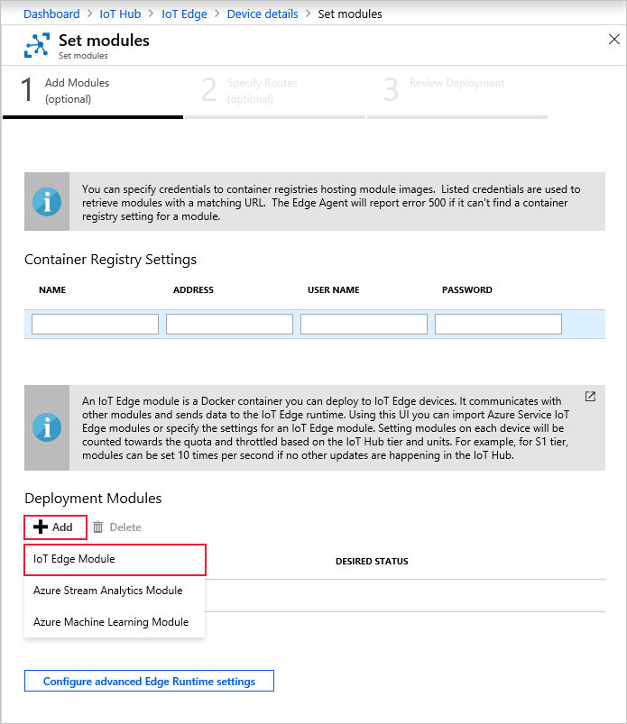

One of the key capabilities of Azure IoT Edge is being able to deploy modules to your IoT Edge devices from the cloud. An IoT Edge module is an executable package implemented as a container. In this section, you deploy a module that generates telemetry for your simulated device.

1. In the Azure portal, navigate to your IoT hub.

2. Go to **IoT Edge** under **Automatic Device Management** and select your IoT Edge device.

3. Select **Set Modules**. A three-step wizard opens in the portal, which guides you through adding modules, specifying routes, and reviewing the deployment. 

4. In the **Add Modules** step of the wizard, find the **Deployment Modules** section. Click **Add** then select **IoT Edge Module**.

   

5. In the **Name** field, enter `tempSensor`.

6. In the **Image URI** field, enter `mcr.microsoft.com/azureiotedge-simulated-temperature-sensor:1.0`.

7. Leave the other settings unchanged, and select **Save**.

   

8. Back in first step of the wizard, select **Next**.

9. In the **Specify Routes** step of the wizard, you should have a default route that sends all messages from all modules to IoT Hub. If not, add the following code then select **Next**.

   ```json
   {
       "routes": {
           "route": "FROM /messages/* INTO $upstream"
       }
   }
   ```

10. In the **Review Deployment** step of the wizard, select **Submit**.

11. Return to the device details page and select **Refresh**. In addition to the edgeAgent module that was created when you first started the service, you should see another runtime module called **edgeHub** and the **tempSensor** module listed.

   It may take a few minutes for the new modules to show up. The IoT Edge device has to retrieve its new deployment information from the cloud, start the containers, and then report its new status back to IoT Hub. 

   
