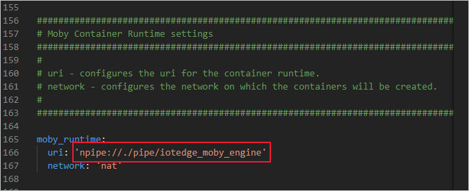

## Verify successful setup

Check the status of the IoT Edge service. It should be listed as running.  

# [Linux](#tab/linux)

```bash
systemctl status iotedge
```

# [Windows](#tab/windows)

```powershell
Get-Service iotedge
```

---

Examine service logs.

# [Linux](#tab/linux)

```bash
journalctl -u iotedge --no-pager --no-full
```

# [Windows](#tab/windows)

If you just finished installing the IoT Edge runtime, you may see a list of errors from the time between running **Deploy-IoTEdge** and **Initialize-IoTEdge**. These errors are expected, as the service is trying to start before being configured.

```powershell
. {Invoke-WebRequest -useb https://aka.ms/iotedge-win} | Invoke-Expression; Get-IoTEdgeLog
```

---

Run the [troubleshooting tool](../articles/iot-edge/troubleshoot.md#run-the-check-command) to check for the most common configuration and networking errors.

```powershell
iotedge check
```

Until you deploy your first module to IoT Edge on your device, the **$edgeHub** system module will not be deployed to the device. As a result, the automated check will return an error for the `Edge Hub can bind to ports on host` connectivity check. This error can be ignored unless it occurs after deploying a module to the device.

Finally, list running modules:

```powershell
iotedge list
```

After a new installation, the only module you should see running is **edgeAgent**.

## Tips and troubleshooting

On resource constrained devices, it is highly recommended that you set the *OptimizeForPerformance* environment variable to *false* as per instructions in the [troubleshooting guide](../articles/iot-edge/troubleshoot.md).

If your device can't connect to IoT Hub and your network has a proxy server, follow the steps in [Configure your IoT Edge device to communicate through a proxy server](../articles/iot-edge/how-to-configure-proxy-support.md).

# [Linux](#tab/linux)

On Linux devices, you need elevated privileges to run `iotedge` commands. After installing the runtime, sign out of your machine and sign back in to update your permissions automatically. Until then, use `sudo` to run commands with elevated privileges.

# [Windows](#tab/windows)

On Windows devices running Windows containers, the Moby container engine was installed as part of IoT Edge. The Moby engine was designed to run in parallel with Docker Desktop. You can use `docker` commands if you want to interact directly with the containers on your device. However, you must specifically target the Moby engine in case Docker Desktop is also installed on the device.

For example, to list all Docker images, use the following command:

```powershell
docker images
```

To list all Moby images, modify the same command with a pointer to the Moby engine:

```powershell
docker -H npipe:////./pipe/iotedge_moby_engine images
```

The engine URI is listed in the output of the installation script, or you can find it in the container runtime settings section for the config.yaml file.



---
