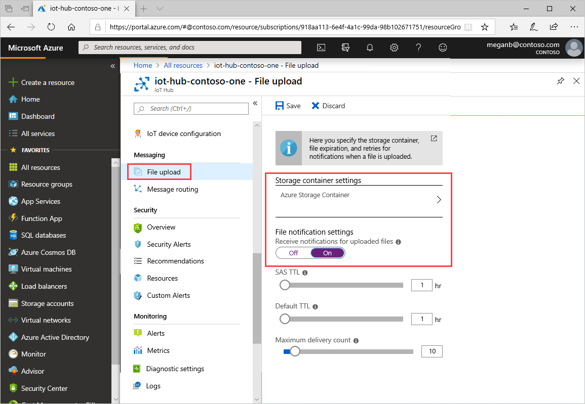

## Associate an Azure Storage account to IoT Hub

You must have an Azure Storage account associated with your IoT hub. To learn how to create one, see [Create a storage account](../articles/storage/common/storage-account-create.md). When you associate an Azure Storage account with an IoT hub, the IoT hub generates a SAS URI. A device can use this SAS URI to securely upload a file to a blob container. The IoT Hub service and the device SDKs coordinate the process that generates the SAS URI and makes it available to a device to use to upload a file.

## Create a container

Follow these steps to create a blob container for your storage account:

1. In the left pane of your storage account, under **Data Storage**, select **Containers**.
1. In the Container blade, select **+ Container**.
1. In the **New container** pane that opens, give your container a name and select **Create**.

After creating a container, follow the instructions in [Configure file uploads using the Azure portal](../articles/iot-hub/iot-hub-configure-file-upload.md). Make sure that a blob container is associated with your IoT hub and that file notifications are enabled

