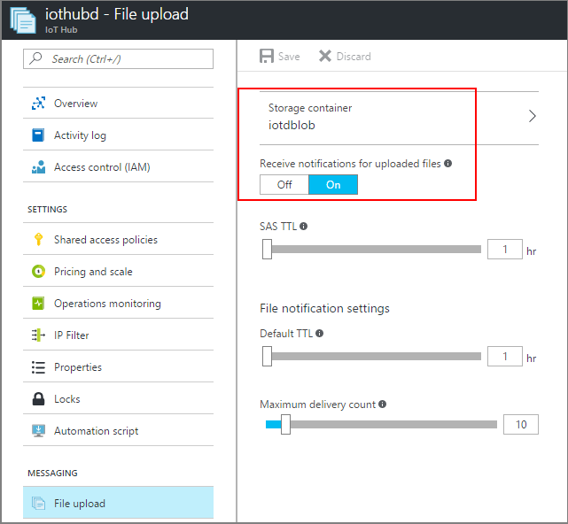

## Associate an Azure Storage account to IoT Hub

Because the simulated device app uploads a file to a blob, you must have an [Azure Storage](../articles/storage/common/storage-quickstart-create-account.md) account associated with your IoT hub. When you associate an Azure Storage account with an IoT hub, the IoT hub generates a SAS URI. A device can use this SAS URI to securely upload a file to a blob container. The IoT Hub service and the device SDKs coordinate the process that generates the SAS URI and makes it available to a device to use to upload a file.

Follow the instructions in [Configure file uploads using the Azure portal](../articles/iot-hub/iot-hub-configure-file-upload.md). Make sure that a blob container is associated with your IoT hub and that file notifications are enabled.

