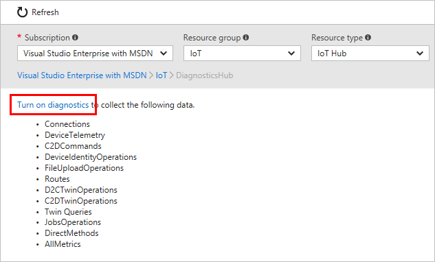

---
 title: include file
 description: include file
 services: iot-hub
 author: dominicbetts
 ms.service: iot-hub
 ms.topic: include
 ms.date: 02/20/2019
 ms.author: dobett
 ms.custom: include file
---

### Enable logging with diagnostics settings

[!INCLUDE [updated-for-az](./updated-for-az.md)]

1. Sign in to the [Azure portal](https://portal.azure.com) and navigate to your IoT hub.

2. Select **Diagnostics settings**.

3. Select **Turn on diagnostics**.

   

4. Give the diagnostic settings a name.

5. Choose where you want to send the logs. You can select any combination of the three options:

   * Archive to a storage account
   * Stream to an event hub
   * Send to Log Analytics

6. Choose which operations you want to monitor, and enable logs for those operations. The operations that diagnostic settings can report on are:

   * Connections
   * Device telemetry
   * Cloud-to-device messages
   * Device identity operations
   * File uploads
   * Message routing
   * Cloud-to-device twin operations
   * Device-to-cloud twin operations
   * Twin operations
   * Job operations
   * Direct methods  
   * Distributed tracing (preview)
   * Configurations
   * Device streams
   * Device metrics

6. Save the new settings. 

If you want to turn on diagnostics settings with PowerShell, use the following code:

```azurepowershell
Connect-AzAccount
Select-AzSubscription -SubscriptionName <subscription that includes your IoT Hub>
Set-AzDiagnosticSetting -ResourceId <your resource Id> -ServiceBusRuleId <your service bus rule Id> -Enabled $true
```

New settings take effect in about 10 minutes. After that, logs appear in the configured archival target on the **Diagnostics settings** blade. For more information about configuring diagnostics, see [Collect and consume log data from your Azure resources](../articles/azure-monitor/platform/platform-logs-overview.md).
