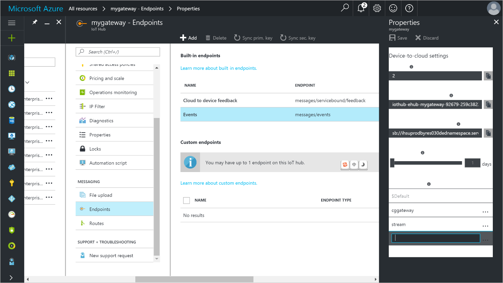

## Add a consumer group to your IoT hub

Consumer groups are used by applications to pull data from Azure IoT Hub. In this lesson, you create a consumer group to be used by a coming Azure service to read data from your IoT hub.

To add a consumer group to your IoT hub, follow these steps:

1. In the [Azure portal](https://ms.portal.azure.com/), open your IoT hub.
1. Click **Endpoints** on the left pane, select **Events** on the middle pane, enter a name under **Consumer groups** on the right pane, and then click **Save**.

   