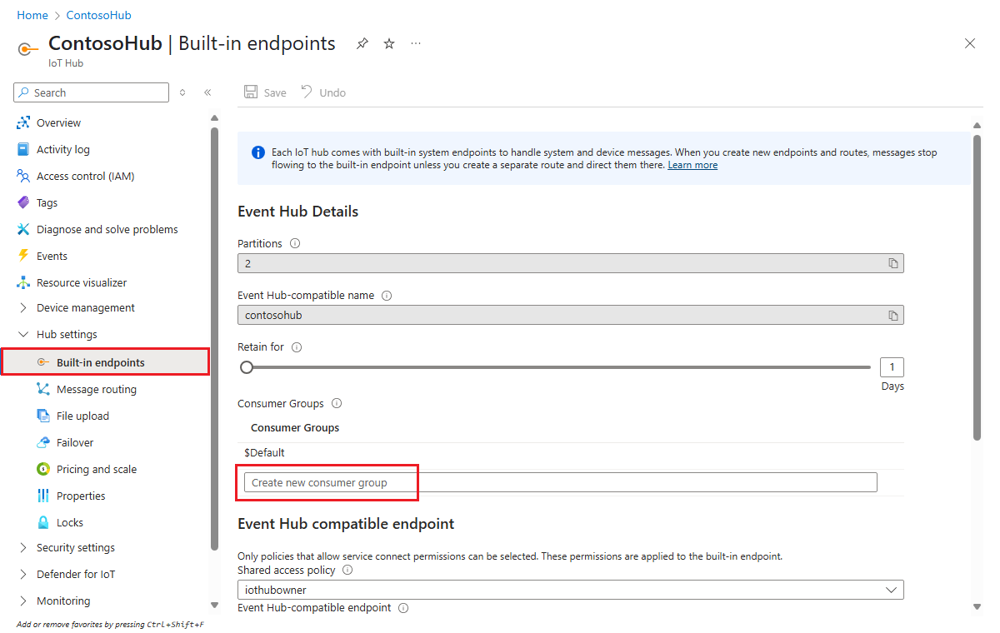

## Add a consumer group to your IoT hub

[Consumer groups](https://docs.microsoft.com/azure/event-hubs/event-hubs-features#event-consumers) provide independent views into the event stream that enable apps and Azure services to independently consume data from the same Event Hub endpoint. In this section, you add a consumer group to your IoT hub's built-in endpoint that is used later in this tutorial to pull data from the endpoint.

To add a consumer group to your IoT hub, follow these steps:

1. In the [Azure portal](https://portal.azure.com/), open your IoT hub.

2. On the left pane, select **Built-in endpoints**, select **Events** on the right pane, and enter a name under **Consumer groups**. Select **Save**.

   
