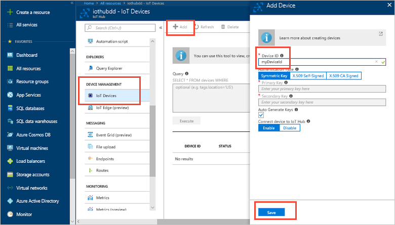
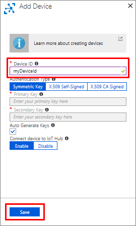
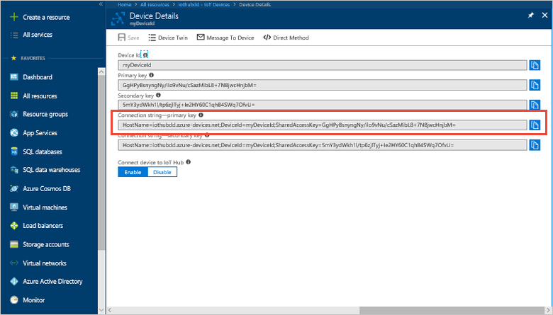

## Create a device identity

In this section, you use the [Azure portal](https://portal.azure.com) to create a device identity in the identity registry in your IoT hub. A device cannot connect to IoT hub unless it has an entry in the identity registry. For more information, see the "Identity registry" section of the [IoT Hub developer guide](../articles/iot-hub/iot-hub-devguide-identity-registry.md) Use the **IoT Devices** panel in the portal to generate a unique device ID and key for your device to use to identify itself to IoT Hub. Device IDs are case-sensitive.

1. Sign in to the [Azure portal](https://portal.azure.com)

1. Select **All resources** and find your IoT hub resource.

1. When your IoT hub resource is opened, click the **IoT Devices** tool, and then click **Add** at the top. 

    

1. Provide a name for your new device, such as **myDeviceId**, and click **Save**. This action creates a new device identity for your IoT hub.

   [!INCLUDE [iot-hub-pii-note-naming-device](iot-hub-pii-note-naming-device.md)]

   

1. In the device list, click the newly created device and copy the **Connection string---primary key** to use later.

    

> [!NOTE]
> The IoT Hub identity registry only stores device identities to enable secure access to the IoT hub. It stores device IDs and keys to use as security credentials, and an enabled/disabled flag that you can use to disable access for an individual device. If your application needs to store other device-specific metadata, it should use an application-specific store. For more information, see [IoT Hub developer guide](../articles/iot-hub/iot-hub-devguide-identity-registry.md).
