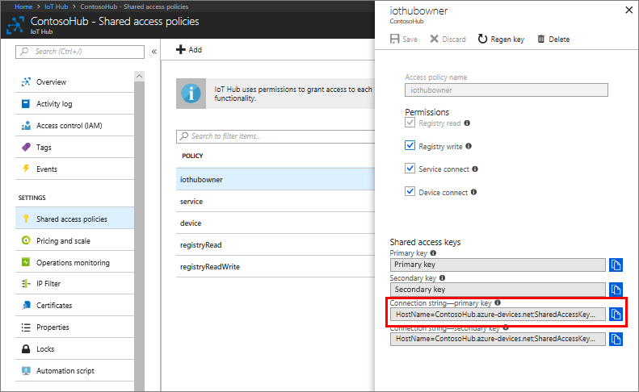
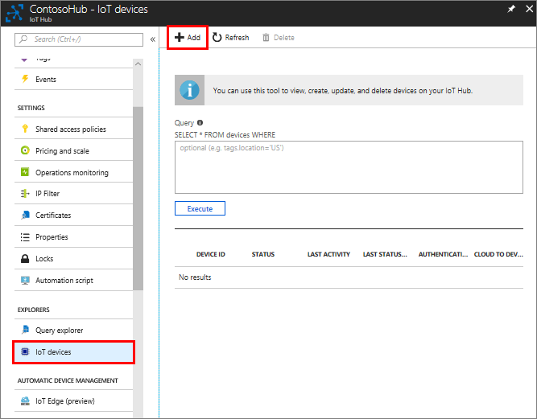
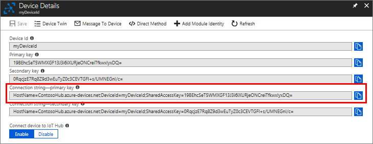

## Create an IoT hub

[!INCLUDE [iot-hub-create-hub](iot-hub-create-hub.md)]

Now that you have created an IoT hub, locate the important information that you use to connect devices and applications to your IoT hub. 

In your IoT hub navigation menu, open **Shared access policies**. Select the **iothubowner** policy, and then copy the **Connection string---primary key** of your IoT hub. For more information, see [Control access to IoT Hub](../articles/iot-hub/iot-hub-devguide-security.md).

   > [!NOTE] 
   > You do not need the iothubowner connection string for this set-up tutorial. However, you may need it for some of the tutorials or different IoT scenarios after you complete this set-up.

   

## Register your device in the IoT hub

1. In your IoT hub navigation menu, open **IoT devices**, then click **Add** to register a device in your IoT hub.

   

2. Enter a **Device ID** for the new device. Device IDs are case sensitive.

   [!INCLUDE [iot-hub-pii-note-naming-device](iot-hub-pii-note-naming-device.md)]

3. Click **Save**.

4. After the device is created, open the device from the list in the **IoT devices** pane.

5. Copy the **Connection string---primary key** to use later.

   
