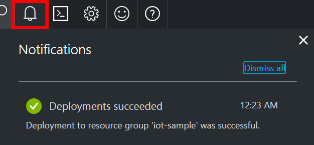
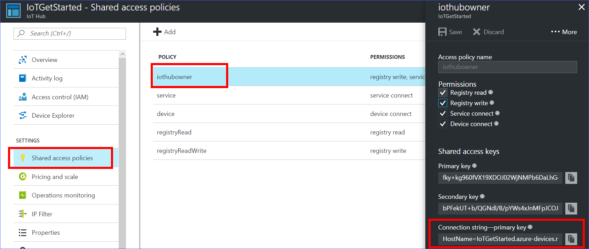
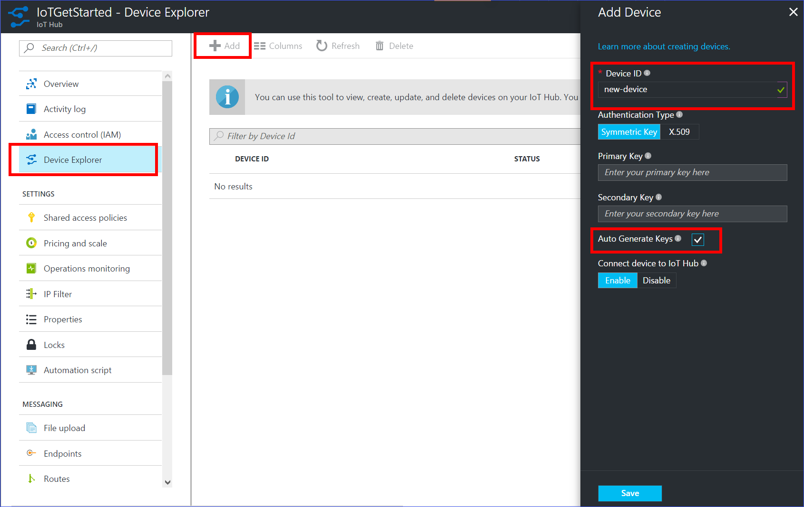

## Create an IoT hub

1. In the [Azure portal](https://portal.azure.com/), click **New** > **Internet of Things** > **IoT Hub**.

   
1. In the **IoT hub** pane, enter the following information for your IoT hub:

   **Name**: It is the name for your IoT hub. If the name you enter is valid, a green check mark appears.

   **Pricing and scale tier**: Select the free F1 tier. This option is sufficient for this demo. See [pricing and scale tier](https://azure.microsoft.com/pricing/details/iot-hub/).

   **Resource group**: Create a resource group to host the IoT hub or use an existing one. See [Using resource groups to manage your Azure resources](../articles/azure-resource-manager/resource-group-portal.md).

   **Location**: Select the closest location to you where the IoT hub is created.

   **Pin the dashboard**: Check this option for easy access to your IoT hub from the dashboard.

   

1. Click **Create**. It could take a few minutes for your IoT hub to be created. You can see progress in the **Notifications** pane.

   

1. Once your IoT hub is created, click it from the dashboard. Make a note of the **Hostname**, and then click **Shared access policies**.

   

1. In the **Shared access policies** pane, click the **iothubowner** policy, and then copy and make a note of the **Connection string** of your IoT hub. For more information, see [Control access to IoT Hub](../articles/iot-hub/iot-hub-devguide-security.md).

   

## Register a device in the IoT hub for the your device

1. In the [Azure portal](https://portal.azure.com/), open your IoT hub.
1. Click **Device Explorer**.
1. In the Device Explorer pane, click **Add** to add a device to your IoT hub.

   **Device ID**: The ID of the new device. Device IDs are case sensitive.

   **Authentication Type**: Select **Symmetric Key**.

   **Auto Generate Keys**: Check this field.

   **Connect device to IoT Hub**: Click **Enable**.

   

1. Click **Save**.
1. After the device is created, open the device in the **Device Explorer** pane.
1. Make a note of the primary key of the connection string.

   