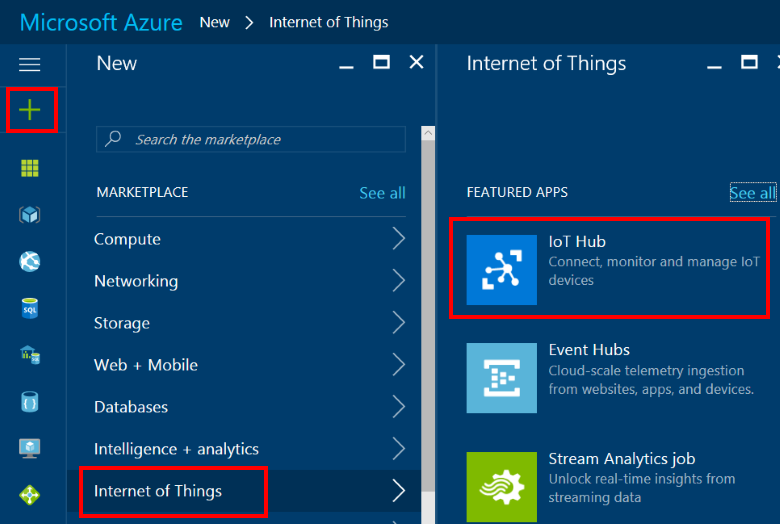
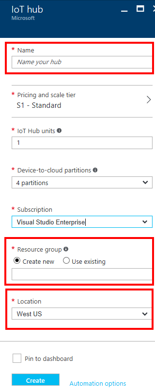
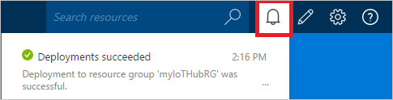
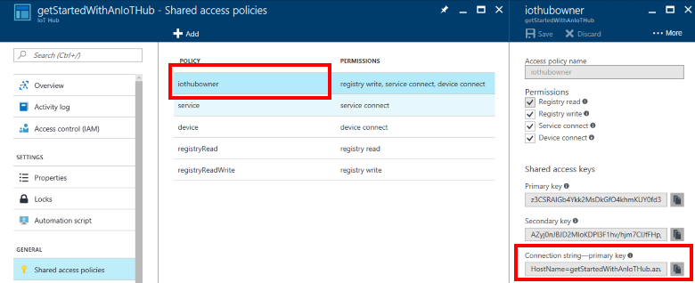

## Create an IoT hub
Create an IoT hub for your simulated device app to connect to. The following steps show you how to complete this task by using the Azure portal.

1. Sign in to the [Azure portal](https://portal.azure.com/).

2. Select **Create a resource** > **Internet of Things** > **IoT Hub**.
   
    

3. In the **IoT hub** pane, enter the following information for your IoT hub:

   * **Subscription**: Choose the subscription that you want to use to create this IoT hub.

   * **Resource group**: Create a resource group to host the IoT hub or use an existing one. For more information, see [Use resource groups to manage your Azure resources](../articles/azure-resource-manager/resource-group-portal.md).

   * **Region**: Select the closest location to you.

   * **Name**: Create a name for your IoT hub. If the name you enter is available, a green check mark appears.

   [!INCLUDE [iot-hub-pii-note-naming-hub](iot-hub-pii-note-naming-hub.md)]

   

4. Select **Next: Size and scale** to continue creating your IoT hub. 

5. Choose your **Pricing and scale tier**. For this article, select the **F1 - Free** tier if it's still available on your subscription. For more information, see the [Pricing and scale tier](https://azure.microsoft.com/pricing/details/iot-hub/).

   

6. Select **Review + create**.

7. Review your IoT hub information, then click **Create**. Your IoT hub might take a few minutes to create. You can monitor the progress in the **Notifications** pane.

8. When your new IoT hub is ready, click its tile in the Azure portal to open its properties window. Now that you have created an IoT hub, locate the important information that you use to connect devices and applications to your IoT hub. Click **Shared access policies**.
   
9. In **Shared access policies**, select the **iothubowner** policy. Copy the IoT Hub **Connection string---primary key** to use later. For more information, see [Access control](../articles/iot-hub/iot-hub-devguide-security.md) in the "IoT Hub developer guide."
   
    