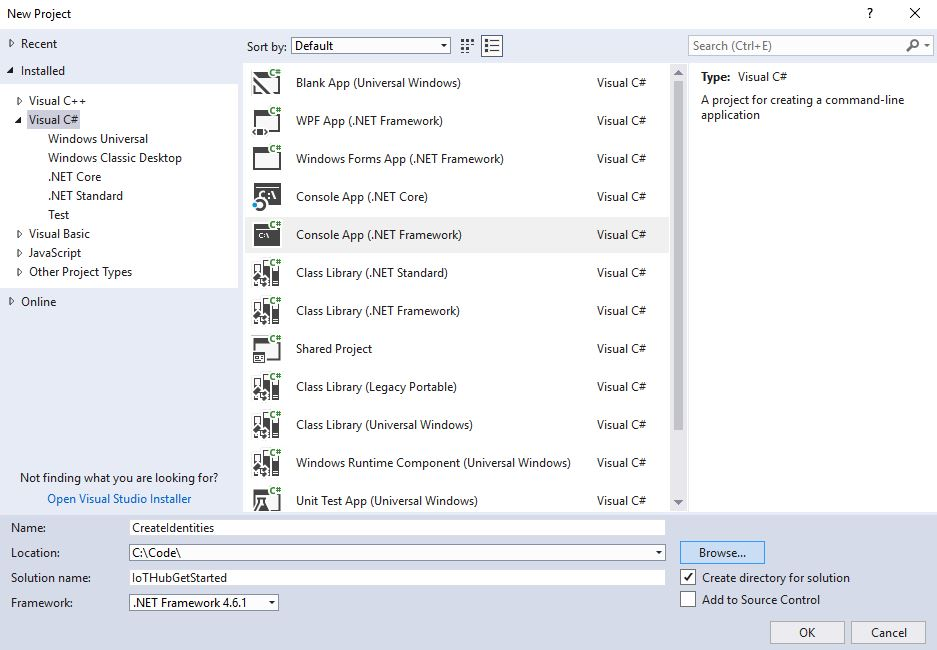
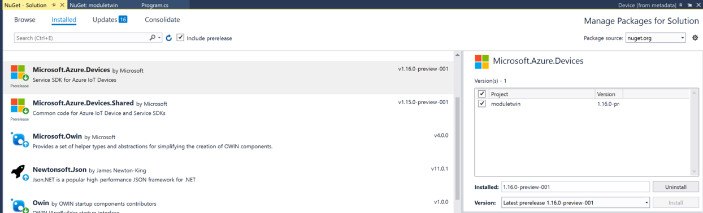

## Create a module identity

In this section, you create a .NET console app that creates a device identity and a module identity in the identity registry in your IoT hub. A device or module cannot connect to IoT hub unless it has an entry in the identity registry. For more information, see the [Identity Registry section of the IoT Hub developer guide](../articles/iot-hub/iot-hub-devguide-identity-registry.md). When you run this console app, it generates a unique ID and key for both device and module. Your device and module use these values to identify itself when it sends device-to-cloud messages to IoT Hub. The IDs are case-sensitive.


1. **Create a Visual Studio project** - In Visual Studio, add a Visual C# Windows Classic Desktop project to a new solution by using the **Console App (.NET Framework)** project template. Make sure the .NET Framework version is 4.6.1 or later. Name the project **CreateIdentities** and name the solution **IoTHubGetStarted**.

    

2. **Install Azure IoT Hub .NET service SDK V1.16.0-preview-001** - Module identity and module twin is in public preview. It's only available in the IoT Hub prerelease service SDKs. In Visual Studio, open tools > Nuget package manager > manage Nuget packages for solution. Search Microsoft.Azure.Devices. Make sure you've checked include prerelease check box. Select version 1.16.0-preview-001 and install. Now you have access to all the module features. 

    

3. Add the following `using` statements at the top of the **Program.cs** file:

   ```csharp
   using Microsoft.Azure.Devices;
   using Microsoft.Azure.Devices.Common.Exceptions;
   ```

4. Add the following fields to the **Program** class. Replace the placeholder value with the IoT Hub connection string for the hub that you created in the previous section.

   ```csharp
   const string connectionString = "<replace_with_iothub_connection_string>";
   const string deviceID = "myFirstDevice";
   const string moduleID = "myFirstModule";
   ```

5. Add the following code to the **Main** class.
   
   ```csharp
   static void Main(string[] args)
   {
       AddDeviceAsync().Wait();
       AddModuleAsync().Wait();
   }
   ```

6. Add the following methods to the **Program** class:

    ```csharp
    private static async Task AddDeviceAsync()
    {
       RegistryManager registryManager = 
         RegistryManager.CreateFromConnectionString(connectionString);
       Device device;

       try
       {
           device = await registryManager.AddDeviceAsync(new Device(deviceID));
       }
       catch (DeviceAlreadyExistsException)
        {
            device = await registryManager.GetDeviceAsync(deviceID);
        }

        Console.WriteLine("Generated device key: {0}", 
          device.Authentication.SymmetricKey.PrimaryKey);
    }

    private static async Task AddModuleAsync()
    {
        RegistryManager registryManager = 
          RegistryManager.CreateFromConnectionString(connectionString);
        Module module;

        try
        {
            module = 
              await registryManager.AddModuleAsync(new Module(deviceID, moduleID));
        }
        catch (ModuleAlreadyExistsException)
        {
            module = await registryManager.GetModuleAsync(deviceID, moduleID);
        }

        Console.WriteLine("Generated module key: {0}", module.Authentication.SymmetricKey.PrimaryKey);
    }
    ```

    The AddDeviceAsync() method creates a device identity with ID **myFirstDevice**. (If that device ID already exists in the identity registry, the code simply retrieves the existing device information.) The app then displays the primary key for that identity. You use this key in the simulated device app to connect to your IoT hub.

    The AddModuleAsync() method creates a module identity with ID **myFirstModule** under device **myFirstDevice**. (If that module ID already exists in the identity registry, the code simply retrieves the existing module information.) The app then displays the primary key for that identity. You use this key in the simulated module app to connect to your IoT hub.

   [!INCLUDE [iot-hub-pii-note-naming-device](iot-hub-pii-note-naming-device.md)]

7. Run this application, and make a note of the device key and module key.

> [!NOTE]
> The IoT Hub identity registry only stores device and module identities to enable secure access to the IoT hub. The identity registry stores device IDs and keys to use as security credentials. The identity registry also stores an enabled/disabled flag for each device that you can use to disable access for that device. If your application needs to store other device-specific metadata, it should use an application-specific store. There is no enabled/disabled flag for module identities. For more information, see [IoT Hub developer guide](../articles/iot-hub/iot-hub-devguide-identity-registry.md).
