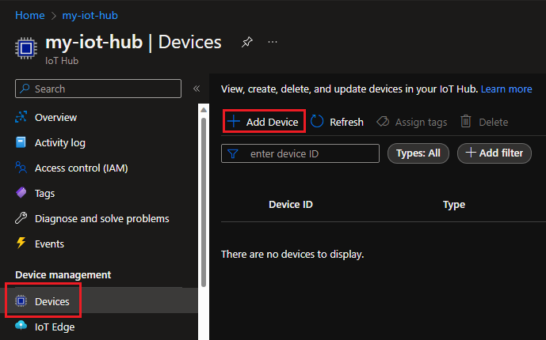
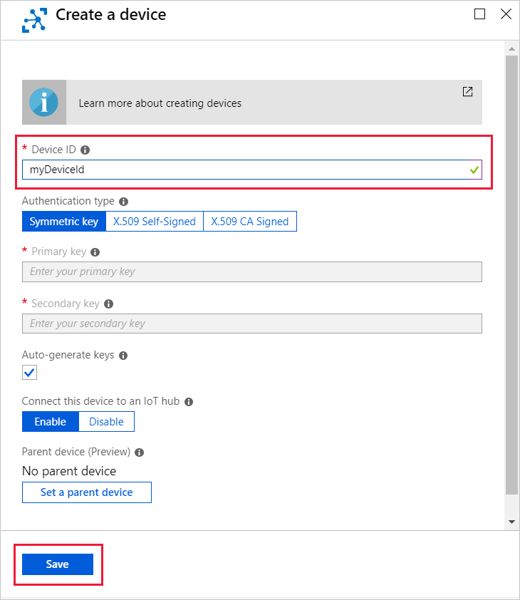
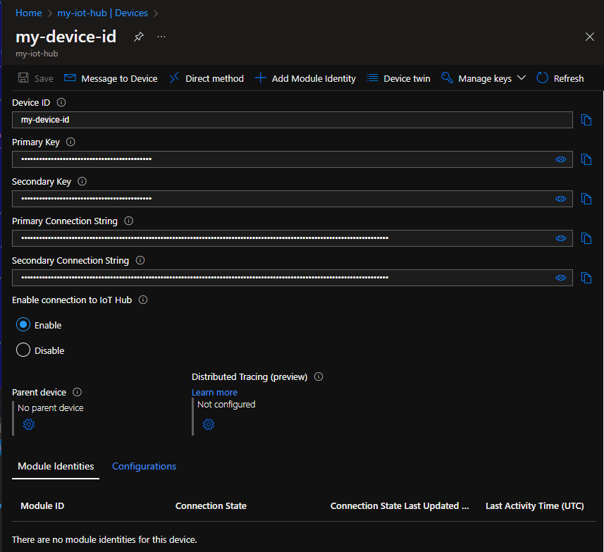

<!-- put the ## header in the file that includes this file -->

In this section, you create a device identity in the identity registry in your IoT hub. A device cannot connect to IoT hub unless it has an entry in the identity registry. For more information, see the "Identity registry" section of the [IoT Hub developer guide](../articles/iot-hub/iot-hub-devguide-identity-registry.md) 

1. In your IoT hub navigation menu, open **IoT Devices**, then select **Add** to register a new device in your IoT hub.

    

1. Provide a name for your new device, such as **myDeviceId**, and select **Save**. This action creates a new device identity for your IoT hub.

   

   [!INCLUDE [iot-hub-pii-note-naming-device](iot-hub-pii-note-naming-device.md)]

1. After the device is created, open the device from the list in the **IoT devices** pane. Copy the **Connection string---primary key** to use later.

    

> [!NOTE]
> The IoT Hub identity registry only stores device identities to enable secure access to the IoT hub. It stores device IDs and keys to use as security credentials, and an enabled/disabled flag that you can use to disable access for an individual device. If your application needs to store other device-specific metadata, it should use an application-specific store. For more information, see [IoT Hub developer guide](../articles/iot-hub/iot-hub-devguide-identity-registry.md).
