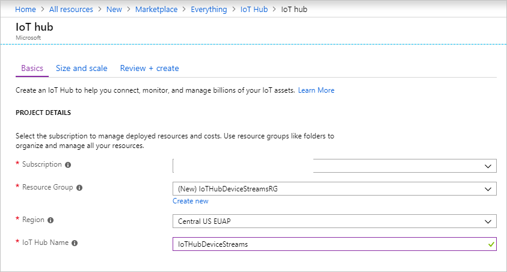
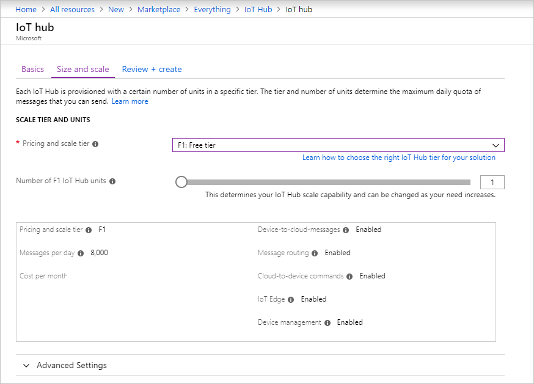
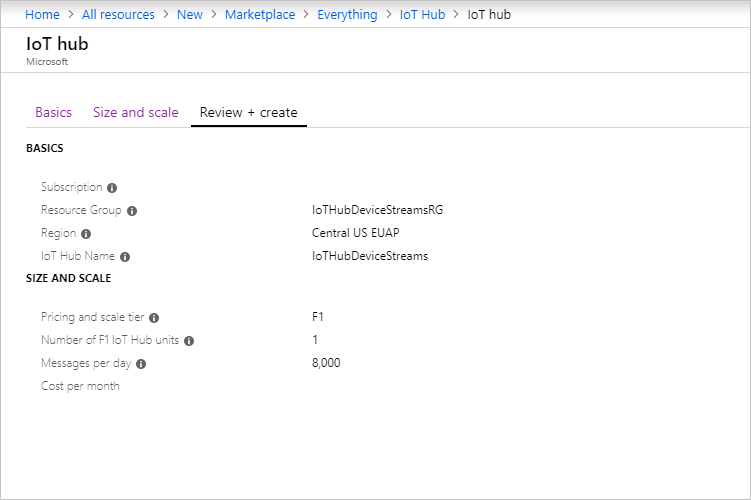

This section describes how to create an IoT hub by using the [Azure portal](https://portal.azure.com).

1. Sign in to the [Azure portal](https://portal.azure.com).

1. Select **Create a resource**, and then select **Internet of Things**.

1. In the list at the right, select **Iot Hub**. The first page for creating an IoT hub opens.

   

   Fill in the fields:

   a. In the **Subscription** drop-down list, select the subscription to use for your IoT hub.

   b. For **Resource Group**, do either of the following: 
      * To create a new resource group, select **Create new** and enter the name you want to use. 
      * To use an existing resource group, select **Use existing** and then, in the drop-down list, select the resource group. 
      
        For more information, see [Manage Azure Resource Manager resource groups](../articles/azure-resource-manager/manage-resource-groups-portal.md).

   c. In the **Region** drop-down list, select the region in which you want your hub to be located. Select a region that supports the IoT Hub device streams preview, either **Central US** or **Central US EUAP**.

   d. In the **IoT Hub Name** box, enter the name for your IoT hub. The name must be globally unique. If the name you enter is available, a green check mark appears.

   [!INCLUDE [iot-hub-pii-note-naming-hub](iot-hub-pii-note-naming-hub.md)]

1. To continue creating your IoT hub, select **Next: Size and scale**.

   

   In this pane, you can accept the default settings and select **Review + create** at the bottom. Consider the following options:

   * In the **Pricing and scale tier** drop-down list, select one of the standard tiers (**S1**, **S2**, or **S3**) or **F1: Free tier**. This choice can also be guided by the size of your fleet and the non-streaming workloads that you expect in your hub (for example, telemetry messages). For example, the free tier is intended for testing and evaluation. It allows 500 devices to be connected to the IoT hub and up to 8,000 messages per day. Each Azure subscription can create one IoT hub in the free tier. 

   * For **Number of IoT Hub units**: This choice depends on non-streaming workload you expect in your hub. You can select 1 for now.

   For more information about tier options, see [Choose the right IoT hub tier](../articles/iot-hub/iot-hub-scaling.md).

1. To review your choices, select the **Review + create** tab. The pane that opens is similar to the following:

   

1. To create your new IoT hub, select **Create**. The process takes a few minutes.
