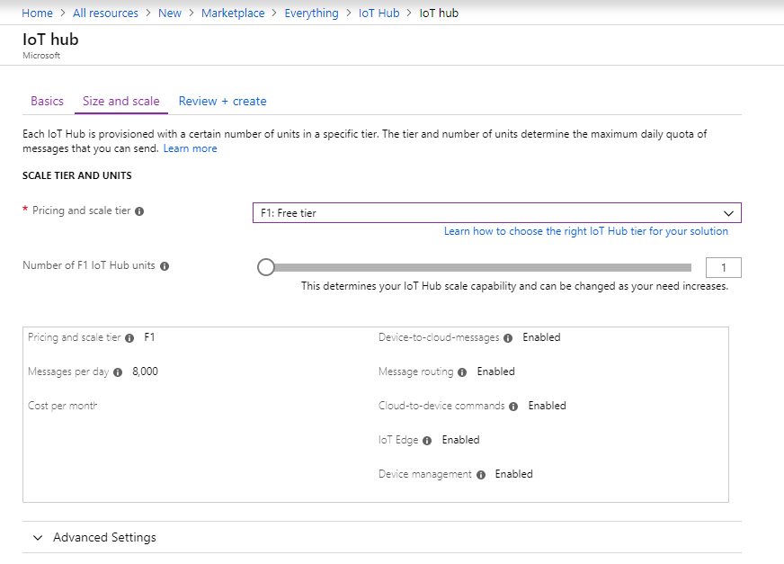

This section describes how to create an IoT hub using the [Azure portal](https://portal.azure.com).

1. Sign in to the [Azure portal](https://portal.azure.com).

2. Choose +**Create a resource**, then choose **Internet of Things**.

3. Click **Iot Hub** from the list on the right. You see the first screen for creating an IoT hub.

   

   Fill in the fields:

   **Subscription**: Select the subscription to use for your IoT hub.

   **Resource Group**: You can create a new resource group or use an existing one. To create a new one, click **Create new** and fill in the name you want to use. To use an existing resource group, click **Use existing** and select the resource group from the dropdown list. For more information, see [Manage Azure Resource Manager resource groups](../articles/azure-resource-manager/manage-resource-groups-portal.md).

   **Region**: This is the region in which you want your hub to be located. Select a region that supports the IoT Hub device streams preview, either Central US or Central US EUAP.

   **IoT Hub Name**: Put in the name for your IoT Hub. This name must be globally unique. If the name you enter is available, a green check mark appears.

   [!INCLUDE [iot-hub-pii-note-naming-hub](iot-hub-pii-note-naming-hub.md)]

4. Click **Next: Size and scale** to continue creating your IoT hub.

   

   On this screen, you can take the defaults and just click **Review + create** at the bottom.

   **Pricing and scale tier**: Ensure you select one of the standard (S1, S2, S3) or the Free (F1) tier. This choice can also be guided by the size of your fleet and the non-streaming workloads you expect in your hub (e.g., telemetry messages). For example, the free tier is intended for testing and evaluation. It allows 500 devices to be connected to the IoT hub and up to 8,000 messages per day. Each Azure subscription can create one IoT Hub in the free tier. 

   **IoT Hub units**: This choice depends on non-streaming workload you expect in your hub - you can select 1 for now.

   For details about the other tier options, see [Choosing the right IoT Hub tier](../articles/iot-hub/iot-hub-scaling.md).

5. Click **Review + create** to review your choices. You see something similar to this screen.

   

6. Click **Create** to create your new IoT hub. Creating the hub takes a few minutes.
