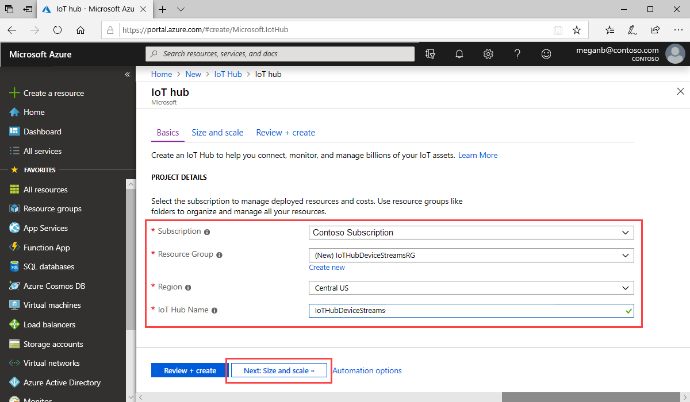

This section describes how to create an IoT hub using the [Azure portal](https://portal.azure.com).

1. Sign in to the [Azure portal](https://portal.azure.com).

1. Choose **Create a resource**, and then enter *IoT Hub* in the **Search the Marketplace** field.

1. Select **IoT Hub** from the search results, and then select **Create**.

1. On the **Basics** tab, complete the fields as follows:

   - **Subscription**: Select the subscription to use for your hub.

   - **Resource Group**: Select a resource group or create a new one. To create a new one, select **Create new** and fill in the name you want to use. To use an existing resource group, select that resource group. For more information, see [Manage Azure Resource Manager resource groups](../articles/azure-resource-manager/management/manage-resource-groups-portal.md).

   - **Region**: Choose the region in which you want your hub to be located. Select a region that supports the IoT Hub device streams preview, either **Central US** or **Central US EUAP**.

   - **IoT Hub Name**: Enter a name for your hub. This name must be globally unique. If the name you enter is available, a green check mark appears.

   

   [!INCLUDE [iot-hub-pii-note-naming-hub](iot-hub-pii-note-naming-hub.md)]

1. Select **Next: Size and scale** to continue creating your hub.

   

   In **Size and scale**, you can accept the default settings and select **Review + create** at the bottom. Consider the following options:

   - **Pricing and scale tier**: Your selected tier. Select one of the standard tiers (**S1**, **S2**, or **S3**) or **F1: Free tier**. This choice can also be guided by the size of your fleet and the non-streaming workloads that you expect in your hub, for example, telemetry messages. For example, the free tier is intended for testing and evaluation. It allows 500 devices to be connected to the IoT hub and up to 8,000 messages per day. Each Azure subscription can create one IoT hub in the free tier. 

   - **Number of IoT Hub units**: The number of messages allowed per unit per day depends on your hub's pricing tier. This choice depends on non-streaming workload you expect in your hub. You can select 1 for now.

   - **Advanced Settings** > **Device-to-cloud partitions**: This property relates the device-to-cloud messages to the number of simultaneous readers of the messages. Most hubs only need four partitions.

   For more information about tier options, see [Choose the right IoT hub tier](../articles/iot-hub/iot-hub-scaling.md).

1. To review your choices, choose **Review + create**. Your results will be similar to the following:

   

1. To create your new IoT hub, select **Create**. The process takes a few minutes.
