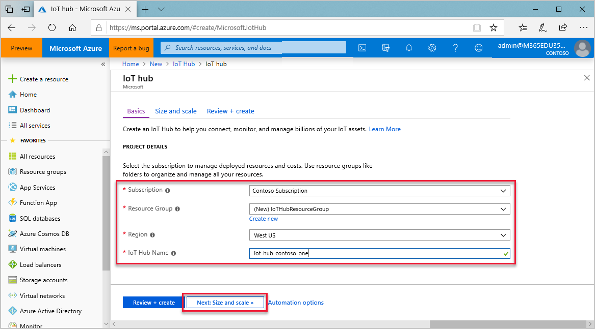
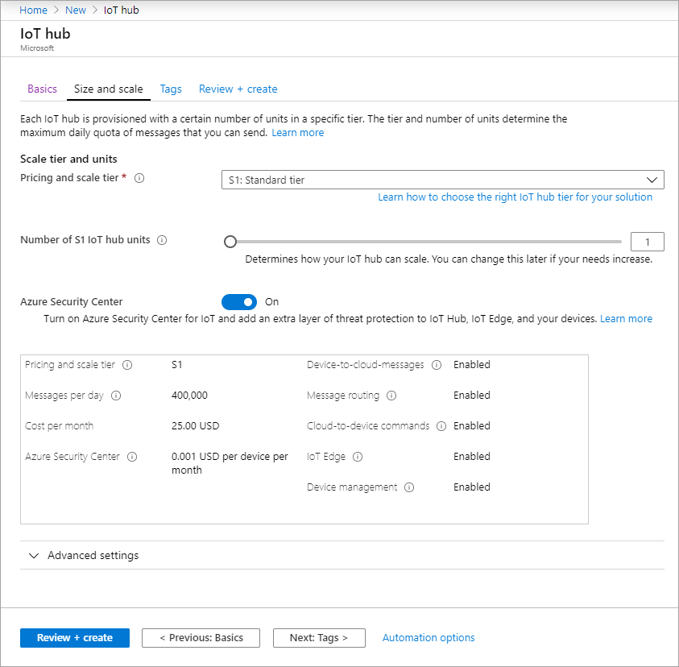
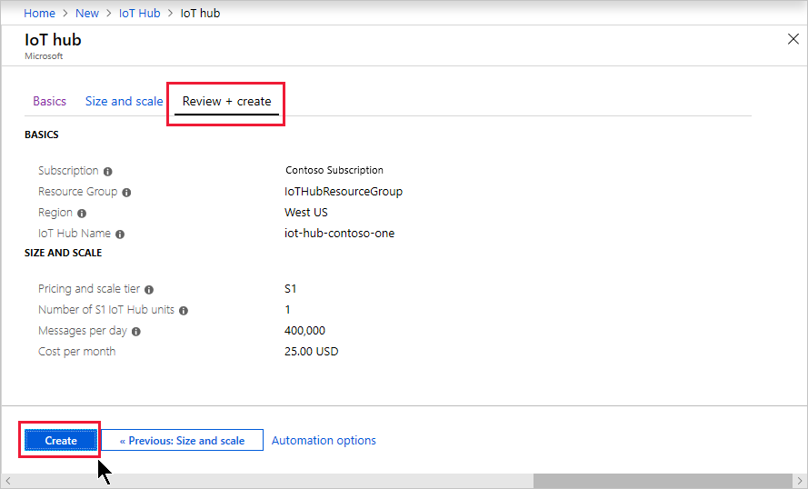

This section describes how to create an IoT hub using the [Azure portal](https://portal.azure.com).

1. Sign in to the [Azure portal](https://portal.azure.com).

1. From the Azure homepage, select the **+ Create a resource** button, and then enter *IoT Hub* in the **Search the Marketplace** field.

1. Select **IoT Hub** from the search results, and then select **Create**.

1. On the **Basics** tab, complete the fields as follows:

   - **Subscription**: Select the subscription to use for your hub.

   - **Resource Group**: Select a resource group or create a new one. To create a new one, select **Create new** and fill in the name you want to use. To use an existing resource group, select that resource group. For more information, see [Manage Azure Resource Manager resource groups](../articles/azure-resource-manager/management/manage-resource-groups-portal.md).

   - **Region**: Select the region in which you want your hub to be located. Select the location closest to you.

   - **IoT Hub Name**: Enter a name for your hub. This name must be globally unique. If the name you enter is available, a green check mark appears.

   [!INCLUDE [iot-hub-pii-note-naming-hub](iot-hub-pii-note-naming-hub.md)]

   

1. Select **Next: Size and scale** to continue creating your hub.

   

    This screen allows you to set the following values:

    - **Pricing and scale tier**: Your selected tier. You can choose from several tiers, depending on how many features you want and how many messages you send through your solution per day. The free tier is intended for testing and evaluation. It allows 500 devices to be connected to the hub and up to 8,000 messages per day. Each Azure subscription can create one IoT hub in the free tier.

    - **IoT Hub units**: The number of messages allowed per unit per day depends on your hub's pricing tier. For example, if you want the hub to support ingress of 700,000 messages, you choose two S1 tier units.
    For details about the other tier options, see [Choosing the right IoT Hub tier](../articles/iot-hub/iot-hub-scaling.md).

    - **Advanced Settings** > **Device-to-cloud partitions**: This property relates the device-to-cloud messages to the number of simultaneous readers of the messages. Most hubs need only four partitions.

1. For this article, accept the default choices, and then select **Review + create** to review your choices. You see something similar to this screen.

   

1. Select **Create** to create your new hub. Creating the hub takes a few minutes.
