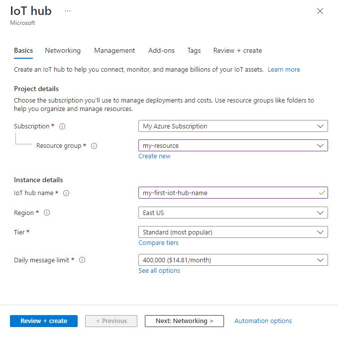

This section describes how to create an IoT hub using the [Azure portal](https://portal.azure.com).

1. Log in to the [Azure portal](https://portal.azure.com). 

2. Choose +**Create a resource**, then *Search the Marketplace* for the **IoT Hub**.

3. Select **IoT Hub** and click the **Create** button. You see the first screen for creating an IoT hub.

   

   Fill in the fields.

   **Subscription**: Select the subscription to use for your IoT hub.

   **Resource Group**: You can create a new resource group or use an existing one. To create a new one, click **Create new** and fill in the name you want to use. To use an existing resource group, click **Use existing** and select the resource group from the dropdown list. For more information, see [Manage Azure Resource Manager resource groups](../articles/azure-resource-manager/manage-resource-groups-portal.md).

   **Region**: This is the region in which you want your hub to be located. Select the location closest to you from the dropdown list.

   **IoT Hub Name**: Put in the name for your IoT Hub. This name must be globally unique. If the name you enter is available, a green check mark appears.

   [!INCLUDE [iot-hub-pii-note-naming-hub](iot-hub-pii-note-naming-hub.md)]

4. Click **Next: Size and scale** to continue creating your IoT hub.

   

   On this screen, you can take the defaults and just click **Review + create** at the bottom. 

   **Pricing and scale tier**: You can choose from several tiers depending on how many features you want and how many messages you send through your solution per day. The free tier is intended for testing and evaluation. It allows 500 devices to be connected to the IoT hub and up to 8,000 messages per day. Each Azure subscription can create one IoT Hub in the free tier. 

   **IoT Hub units**: The number of messages allowed per unit per day depends on your hub's pricing tier. For example, if you want the IoT hub to support ingress of 700,000 messages, you choose two S1 tier units.

   For details about the other tier options, see [Choosing the right IoT Hub tier](../articles/iot-hub/iot-hub-scaling.md).

   **Advanced / Device-to-cloud partitions**: This property relates the device-to-cloud messages to the number of simultaneous readers of the messages. Most IoT hubs only need four partitions. 

5. Click **Review + create** to review your choices. You see something similar to this screen.

   

6. Click **Create** to create your new IoT hub. Creating the hub takes a few minutes.
