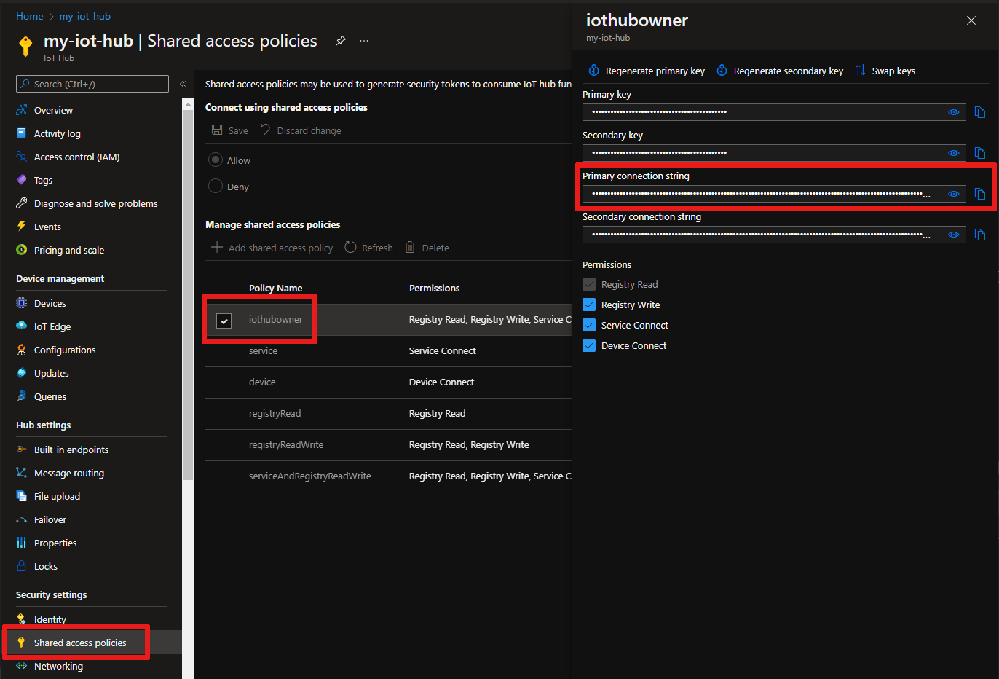

<!-- this tells how to get the connection string for your hub -->
<!-- This assumes the user is looking at his hub in the portal. -->

After your hub has been created, retrieve the connection string for the hub. This is used to connect devices and applications to your hub. 

1. Click on your hub to see the IoT Hub pane with Settings, and so on. Click **Shared access policies**.
   
2. In **Shared access policies**, select the **iothubowner** policy. 

3. Under **Shared access keys**, copy the **Connection string -- primary key** to be used later.

    

    For more information, see [Access control](../articles/iot-hub/iot-hub-devguide-security.md) in the "IoT Hub developer guide."
