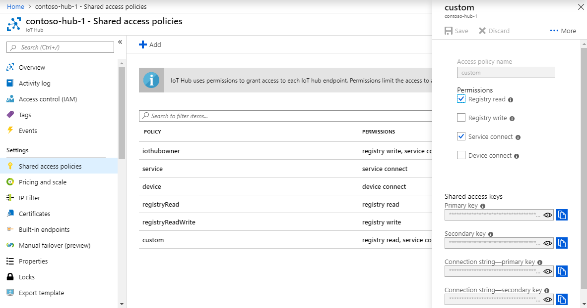

<!-- This tells how to create a custom shared access policy for your IoT hub and get the connection string for it-->

To create a shared access policy that grants **service connect** and **registry read** permissions and get a connection string for this policy, follow these steps:

1. Open your IoT hub in the [Azure portal](https://portal.azure.com). The easiest way to get to your IoT hub is to select **Resource groups**, select the resource group where your IoT hub is located, and then select your IoT hub from the list of resources.

2. On the left-side pane of your IoT hub, select **Shared access policies**.

3. From the top menu above the list of policies, select **Add**.

4. On the **Add a shared access policy** pane, enter a descriptive name for your policy; for example: *serviceAndRegistryRead*. Under **Permissions**, select **Registry read** and **Service connect**, and then select **Create**.

    

5. Back on the **Shared access policies** pane, select your new policy from the list of policies.

6. Under **Shared access keys**, select the copy icon for the **Connection string -- primary key** and save the value.

    

For more information about IoT Hub shared access policies and permissions, see [Access control and permissions](../articles/iot-hub/iot-hub-devguide-security.md#access-control-and-permissions).
