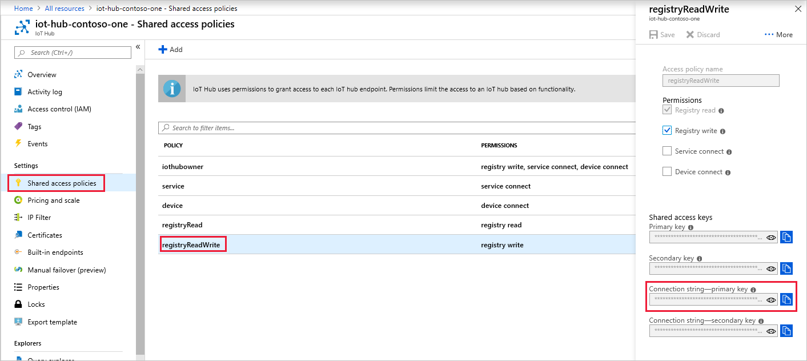

<!-- This tells how to get the connection string for the registryReadWrite shared access policy of your IoT hub -->

To get the IoT Hub connection string for the **registryReadWrite** policy, follow these steps:

1. In the [Azure portal](https://portal.azure.com), select **Resource groups**. Select the resource group where your hub is located, and then select your hub from the list of resources.

2. On the left-side pane of your hub, select **Shared access policies**.

3. From the list of policies, select the **registryReadWrite** policy.

4. Under **Shared access keys**, select the copy icon for the **Connection string -- primary key** and save the value.

    

For more information about IoT Hub shared access policies and permissions, see [Access control and permissions](../articles/iot-hub/iot-hub-devguide-security.md#access-control-and-permissions).
