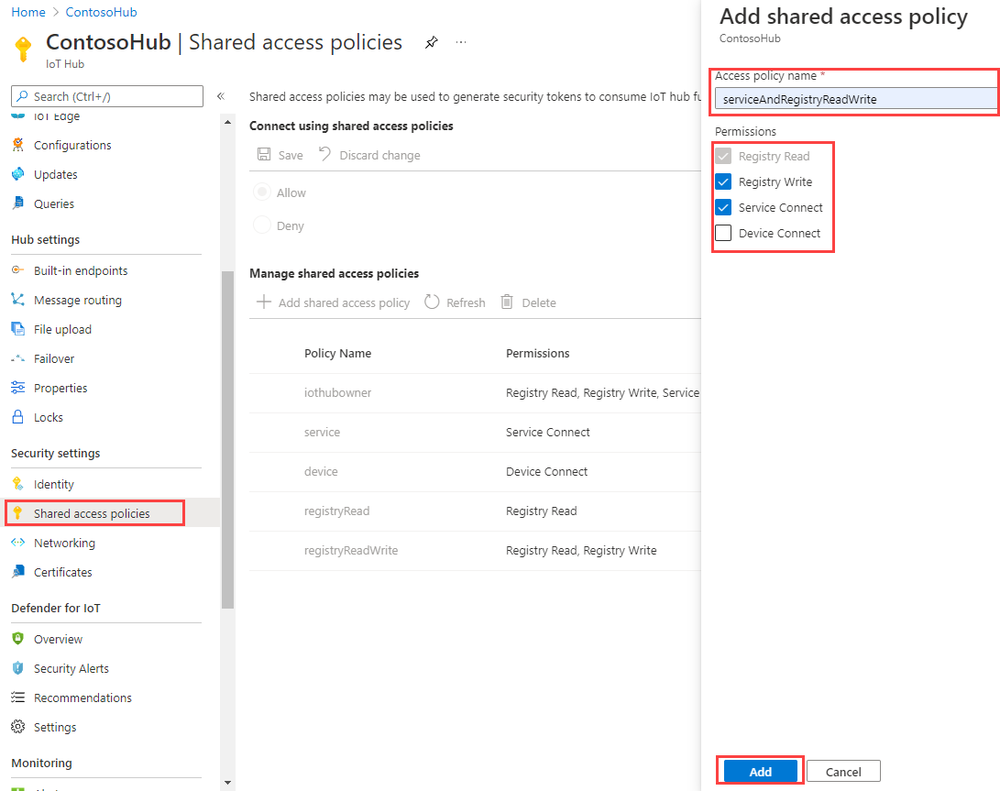
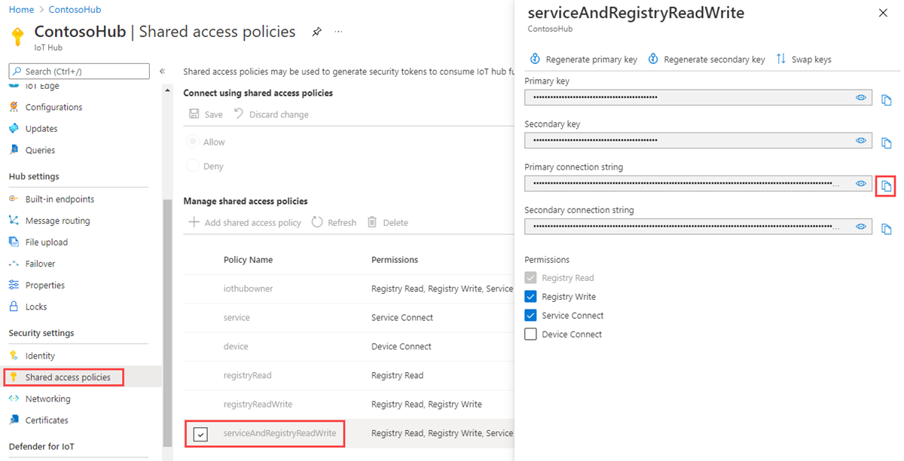

<!-- This tells how to create a custom shared access policy that has service connect and registry RW permissions for your IoT hub and get the connection string for it-->

To create a shared access policy that grants **service connect** and **registry write** permissions and to get a connection string for this policy, follow these steps:

1. In the [Azure portal](https://portal.azure.com), select **Resource groups**. Select the resource group where your hub is located, and then select your hub from the list of resources.

1. On the left-side pane of your hub, select **Shared access policies**.

1. From the top menu above the list of policies, select **Add**.

1. Under **Add a shared access policy**, enter a descriptive name for your policy, such as *serviceAndRegistryReadWrite*. Under **Permissions**, select **Registry write** and **Service connect**, and then select **Create**. (The **Registry read** permission is included automatically when you select **Registry write**.)

    

1. Select your new policy from the list of policies.

1. Under **Shared access keys**, select the copy icon for the **Connection string -- primary key** and save the value.

    

For more information about IoT Hub shared access policies and permissions, see [Access control and permissions](../articles/iot-hub/iot-hub-devguide-security.md#access-control-and-permissions).
