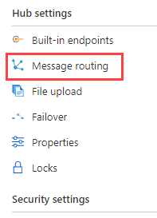
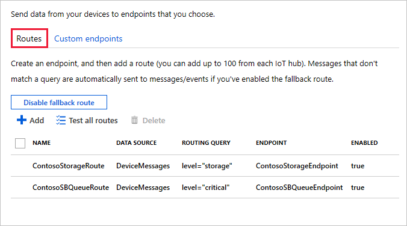
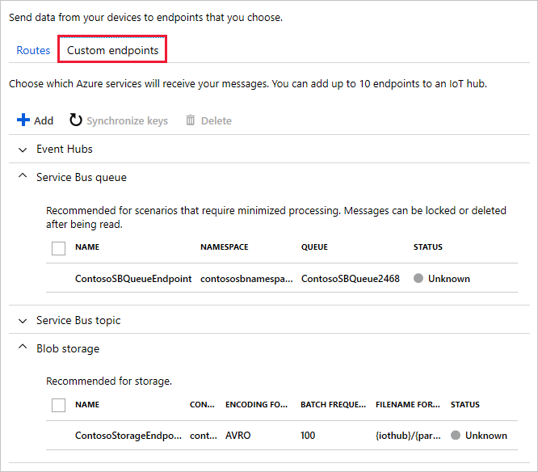

Now that your endpoints and message routes are set up, you can view their configuration in the portal. Sign in to the [Azure portal](https://portal.azure.com) and go to **Resource Groups**. Next, select your resource group, then select your hub  (the hub name starts with `ContosoTestHub` in this tutorial). You see the IoT Hub pane.

In the options for the IoT Hub, select **Message Routing**. The routes you have set up successfully are displayed.

On the **Message routing** screen, select **Custom Endpoints** to see the endpoints you have defined for the routes.

