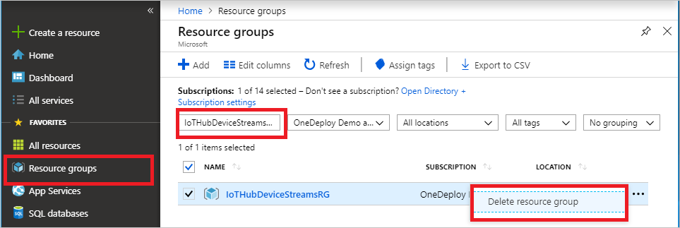

If you plan to continue to the next recommended article, you can keep and reuse the resources you've already created.

Otherwise, to avoid charges, you can delete the Azure resources that you created in this article.

> [!IMPORTANT]
> Deleting a resource group is irreversible. The resource group and all the resources contained in it are permanently deleted. Make sure that you don't accidentally delete the wrong resource group or resources. If you created the IoT hub inside an existing resource group that contains resources that you want to keep, delete only the IoT hub resource itself, not the resource group.
>

To delete a resource group by name:

1. Sign in to the [Azure portal](https://portal.azure.com), and then select **Resource groups**.

1. In the **Filter by name** box, enter the name of the resource group that contains your IoT hub.

1. In the result list, to the right of your resource group, select the ellipsis (**...**), and then select **Delete resource group**.

    

1. To confirm the deletion of the resource group, reenter the resource group name, and then select **Delete**. After a few moments, the resource group and all its contained resources are deleted.
