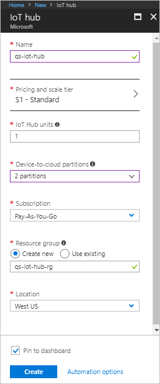

The first step is to use the Azure portal to create an IoT hub in your subscription. The IoT hub enables you to ingest high volumes of telemetry into the cloud from many devices. The hub then enables one or more back-end services running in the cloud to read and process that telemetry.

1. Sign in to the [Azure portal](http://portal.azure.com).

1. Select **Create a resource** > **Internet of Things** > **IoT Hub**.

    

1. To create your IoT hub, use the values in the following table:

    | Setting | Value |
    | ------- | ----- |
    | Name | The following screenshot uses the name **qs-iot-hub**. You must choose your own unique name when you complete this step. |
    | Pricing and scale tier | F1 Free |
    | IoT Hub units | 1 |
    | Device-to-cloud partitions | 2 partitions |
    | Subscription | Select your Azure subscription in the drop-down. |
    | Resource group | Create new. This quickstart uses the name **qs-iot-hub-rg**. |
    | Location | This quickstart uses **West US**. You can choose the location closest to you. |
    | Pin to dashboard | Yes |

    

1. Click **Create**. It can take several minutes for the hub to be created.

1. Make a note of the IoT hub name you chose. You use this value later in the quickstart.