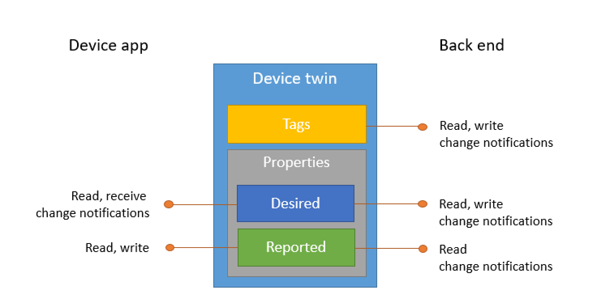

> [!div class="op_single_selector"]
> * [Node.js](../articles/iot-hub/iot-hub-node-node-twin-getstarted.md)
> * [C#](../articles/iot-hub/iot-hub-csharp-csharp-twin-getstarted.md)
> * [Java](../articles/iot-hub/iot-hub-java-java-twin-getstarted.md)
> * [Python](../articles/iot-hub/iot-hub-python-twin-getstarted.md)

Device twins are JSON documents that store device state information (metadata, configurations, and conditions). IoT Hub persists a device twin for each device that connects to it.

[!INCLUDE [iot-hub-basic](iot-hub-basic-whole.md)]

Use device twins to:

* Store device metadata from your solution back end.

* Report current state information such as available capabilities and conditions (for example, the connectivity method used) from your device app.

* Synchronize the state of long-running workflows (such as firmware and configuration updates) between a device app and a back-end app.

* Query your device metadata, configuration, or state.

Device twins are designed for synchronization and for querying device configurations and conditions. More information on when to use device twins can be found in [Understand device twins](../articles/iot-hub/iot-hub-devguide-device-twins.md).

Device twins are stored in an IoT hub and contain:

* *tags*, device metadata accessible only by the solution back end;

* *desired properties*, JSON objects modifiable by the solution back end and observable by the device app; and

* *reported properties*, JSON objects modifiable by the device app and readable by the solution back end. Tags and properties cannot contain arrays, but objects can be nested.

Additionally, the solution back end can query device twins based on all the above data.
Refer to [Understand device twins](../articles/iot-hub/iot-hub-devguide-device-twins.md) for more information about device twins, and to the [IoT Hub query language](../articles/iot-hub/iot-hub-devguide-query-language.md) reference for querying.

This tutorial shows you how to:

* Create a back-end app that adds *tags* to a device twin, and a simulated device app that reports its connectivity channel as a *reported property* on the device twin.

* Query devices from your back-end app using filters on the tags and properties previously created.
