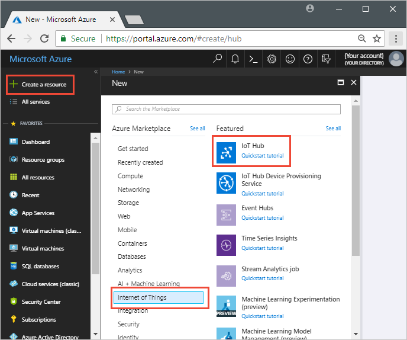
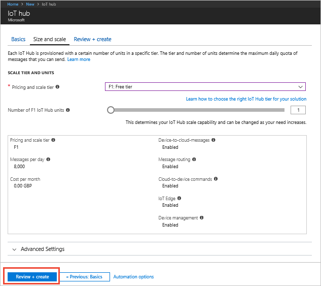
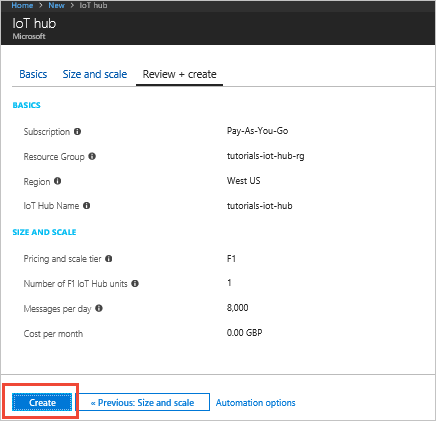

To create an IoT Hub using the Azure portal:

1. Sign in to the [Azure portal](https://portal.azure.com).

1. Select **Create a resource** > **Internet of Things** > **IoT Hub**.

    

1. To create your free-tier IoT hub, use the values in the following tables:

    | Setting | Value |
    | ------- | ----- |
    | Subscription | Select your Azure subscription in the drop-down. |
    | Resource group | Create new. This tutorial uses the name **tutorials-iot-hub-rg**. |
    | Region | This tutorial uses **West US**. You can choose the region closest to you. |
    | Name | The following screenshot uses the name **tutorials-iot-hub**. You must choose your own unique name when you create your hub. |

    

    | Setting | Value |
    | ------- | ----- |
    | Pricing and scale tier | F1 Free. You can only have one free tier hub in a subscription. |
    | IoT Hub units | 1 |

    

1. Click **Create**. It can take several minutes for the hub to be created.

    

1. Make a note of the IoT hub name you chose. You use this value later in the tutorial.
