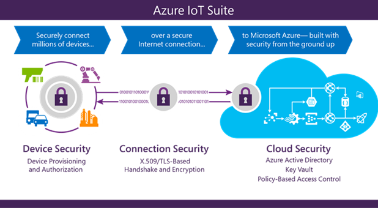

# Security for Internet of Things (IoT) from the ground up

The Internet of Things (IoT) poses unique security, privacy, and compliance challenges to businesses worldwide. Unlike traditional cyber technology where these issues revolve around software and how it is implemented, IoT concerns what happens when the cyber and the physical worlds converge. Protecting IoT solutions requires ensuring secure provisioning of devices, secure connectivity between these devices and the cloud, and secure data protection in the cloud during processing and storage. Working against such functionality, however, are resource-constrained devices, geographic distribution of deployments, and a large number of devices within a solution.

This article explores how the IoT solution accelerators provide a secure and private Internet of Things cloud solution. The solution accelerators deliver a complete end-to-end solution, with security built into every stage from the ground up. At Microsoft, developing secure software is part of the software engineering practice, rooted in Microsoft's decades long experience of developing secure software. To ensure this, Security Development Lifecycle (SDL) is the foundational development methodology, coupled with a host of infrastructure-level security services such as Operational Security Assurance (OSA) and the Microsoft Digital Crimes Unit, Microsoft Security Response Center, and Microsoft Malware Protection Center.

The solution accelerators offer unique features that make provisioning, connecting to, and storing data from IoT devices easy and transparent and, most of all, secure. This article examines the Azure IoT solution accelerators security features and deployment strategies to ensure security, privacy, and compliance challenges are addressed.

## Introduction

The Internet of Things (IoT) is the wave of the future, offering businesses immediate and real-world opportunities to reduce costs, increase revenue, and transform their business. Many businesses, however, are hesitant to deploy IoT in their organizations due to concerns about security, privacy, and compliance. A major point of concern comes from the uniqueness of the IoT infrastructure, which merges the cyber and physical worlds together, compounding individual risks inherent in these two worlds. Security of IoT pertains to ensuring the integrity of code running on devices, providing device and user authentication, defining clear ownership of devices (as well as data generated by those devices), and being resilient to cyber and physical attacks.

Then, there’s the issue of privacy. Companies want transparency concerning data collection, as in what’s being collected and why, who can see it, who controls access, and so on. Finally, there are general safety issues of the equipment along with the people operating them, and issues of maintaining industry standards of compliance.

Given the security, privacy, transparency, and compliance concerns, choosing the right IoT solution provider remains a challenge. Stitching together individual pieces of IoT software and services provided by a variety of vendors introduces gaps in security, privacy, transparency, and compliance, which may be hard to detect, let alone fix. The choice of the right IoT software and service provider is based on finding providers that have extensive experience running services, which span across verticals and geographies, but are also able to scale in a secure and transparent fashion. Similarly, it helps for the selected provider to have decades of experience with developing secure software running on billions of machines worldwide, and have the ability to appreciate the threat landscape posed by this new world of the Internet of Things.

## Secure infrastructure from the ground up

The [Microsoft Cloud](https://azure.microsoft.com) infrastructure supports more than one billion customers in 127 countries/regions. Drawing on Microsoft's decades-long experience building enterprise software and running some of the largest online services in the world, the Microsoft Cloud provides higher levels of enhanced security, privacy, compliance, and threat mitigation practices than most customers could achieve on their own.

The [Security Development Lifecycle (SDL)](https://www.microsoft.com/sdl/) provides a mandatory company-wide development process that embeds security requirements into the entire software lifecycle. To help ensure that operational activities follow the same level of security practices, SDL uses rigorous security guidelines laid out in Microsoft's Operational Security Assurance (OSA) process. Microsoft also works with third-party audit firms for ongoing verification that it meets its compliance obligations, and Microsoft engages in broad security efforts through the creation of centers of excellence, including the Microsoft Digital Crimes Unit, Microsoft Security Response Center, and Microsoft Malware Protection Center.

## Microsoft Azure - secure IoT infrastructure for your business

Microsoft Azure offers a complete cloud solution, one that combines a constantly growing collection of integrated cloud services—analytics, machine learning, storage, security, networking, and web—with an industry-leading commitment to the protection and privacy of your data. Microsoft's [assume breach](https://azure.microsoft.com/blog/red-teaming-using-cutting-edge-threat-simulation-to-harden-the-microsoft-enterprise-cloud/) strategy uses a dedicated *red team* of software security experts who simulate attacks, testing the ability of Azure to detect, protect against emerging threats, and recover from breaches. Microsoft's [global incident response](https://www.microsoft.com/en-us/TrustCenter/Security/DesignOpSecurity) team works around the clock to mitigate the effects of attacks and malicious activity. The team follows established procedures for incident management, communication, and recovery, and uses discoverable and predictable interfaces with internal and external partners.

Microsoft's systems provide continuous intrusion detection and prevention, service attack prevention, regular penetration testing, and forensic tools that help identify and mitigate threats. [Multi-factor authentication](../articles/active-directory/authentication/multi-factor-authentication.md) provides an extra layer of security for end users to access the network. And for the application and the host provider, Microsoft offers access control, monitoring, anti-malware, vulnerability scanning, patches, and configuration management.

The solution accelerators take advantage of the security and privacy built into the Azure platform along with the SDL and OSA processes for secure development and operation of all Microsoft software. These procedures provide infrastructure protection, network protection, and identity and management features fundamental to the security of any solution.

The [Azure IoT Hub](../articles/iot-hub/about-iot-hub.md) within the [IoT solution accelerators](../articles/iot-fundamentals/iot-introduction.md) offers a fully-managed service that enables reliable and secure bi-directional communication between IoT devices and Azure services such as [Azure Machine Learning](../articles/machine-learning/studio/what-is-machine-learning.md) and [Azure Stream Analytics](../articles/stream-analytics/stream-analytics-introduction.md) by using per-device security credentials and access control.

To best communicate security and privacy features built into the Azure IoT solution accelerators, this article breaks down the suite into the three primary security areas.

### Secure device provisioning and authentication

The solution accelerators secure devices while they are out in the field by providing a unique identity key for each device, which can be used by the IoT infrastructure to communicate with the device while it is in operation. The process is quick and easy to set up. The generated key with a user-selected device ID forms the basis of a token used in all communication between the device and the Azure IoT Hub.

Device IDs can be associated with a device during manufacturing (that is, flashed in a hardware trust module) or can use an existing fixed identity as a proxy (for example CPU serial numbers). Since changing this identifying information in the device is not simple, it is important to introduce logical device IDs in case the underlying device hardware changes but the logical device remains the same. In some cases, the association of a device identity can happen at device deployment time (for example, an authenticated field engineer physically configures a new device while communicating with the solution backend). The [Azure IoT Hub identity registry](../articles/iot-hub/iot-hub-devguide.md) provides secure storage of device identities and security keys for a solution. Individual or groups of device identities can be added to an allow list, or a block list, enabling complete control over device access.

Azure IoT Hub access control policies in the cloud enable activation and disabling any device identity, providing a way to disassociate a device from an IoT deployment when required. This association and disassociation of devices is based on each device identity.

Additional device security features include:

* Devices do not accept unsolicited network connections. They establish all connections and routes in an outbound-only fashion. For a device to receive a command from the backend, the device must initiate a connection to check for any pending commands to process. Once a connection between the device and IoT Hub is securely established, messaging from the cloud to the device and device to the cloud can be sent transparently.

* Devices only connect to or establish routes to well-known services with which they are peered, such as an Azure IoT Hub.

* System-level authorization and authentication use per-device identities, making access credentials and permissions near-instantly revocable.

### Secure connectivity

Durability of messaging is an important feature of any IoT solution. The need to durably deliver commands and/or receive data from devices is underlined by the fact that IoT devices are connected over the Internet, or other similar networks that can be unreliable. Azure IoT Hub offers durability of messaging between cloud and devices through a system of acknowledgments in response to messages. Additional durability for messaging is achieved by caching messages in the IoT Hub for up to seven days for telemetry and two days for commands.

Efficiency is important to ensure conservation of resources and operation in a resource-constrained environment. HTTPS (HTTP Secure), the industry-standard secure version of the popular http protocol, is supported by Azure IoT Hub, enabling efficient communication. Advanced Message Queuing Protocol (AMQP) and Message Queuing Telemetry Transport (MQTT), supported by Azure IoT Hub, are designed not only for efficiency in terms of resource use but also reliable message delivery. 

Scalability requires the ability to securely interoperate with a wide range of devices. Azure IoT hub enables secure connection to both IP-enabled and non-IP-enabled devices. IP-enabled devices are able to directly connect and communicate with the IoT Hub over a secure connection. Non-IP-enabled devices are resource-constrained and connect only over short distance communication protocols, such as Zwave, ZigBee, and Bluetooth. A field gateway is used to aggregate these devices and performs protocol translation to enable secure bi-directional communication with the cloud.

Additional connection security features include:

* The communication path between devices and Azure IoT Hub, or between gateways and Azure IoT Hub, is secured using industry-standard Transport Layer Security (TLS) with Azure IoT Hub authenticated using X.509 protocol.

* In order to protect devices from unsolicited inbound connections, Azure IoT Hub does not open any connection to the device. The device initiates all connections.

* Azure IoT Hub durably stores messages for devices and waits for the device to connect. These commands are stored for two days, enabling devices connecting sporadically, due to power or connectivity concerns, to receive these commands. Azure IoT Hub maintains a per-device queue for each device.

### Secure processing and storage in the cloud

From encrypted communications to processing data in the cloud, the solution accelerators help keep data secure. It provides flexibility to implement additional encryption and management of security keys.

Using Azure Active Directory (AAD) for user authentication and authorization, Azure IoT solution accelerators can provide a policy-based authorization model for data in the cloud, enabling easy access management that can be audited and reviewed. This model also enables near-instant revocation of access to data in the cloud, and of devices connected to the Azure IoT solution accelerators.

Once data is in the cloud, it can be processed and stored in any user-defined workflow. Access to each part of the data is controlled with Azure Active Directory, depending on the storage service used.

All keys used by the IoT infrastructure are stored in the cloud in secure storage, with the ability to roll over in case keys need to be reprovisioned. Data can be stored in [Azure Cosmos DB](../articles/cosmos-db/introduction.md) or in [SQL databases](../articles/sql-database/sql-database-faq.md), enabling definition of the level of security desired. Additionally, Azure provides a way to monitor and audit all access to your data to alert you of any intrusion or unauthorized access.

## Conclusion

The Internet of Things starts with your things—the things that matter most to businesses. IoT can deliver amazing value to a business by reducing costs, increasing revenue, and transforming business. Success of this transformation largely depends on choosing the right IoT software and service provider. That means finding a provider that not only catalyzes this transformation by understanding business needs and requirements, but also provides services and software built with security, privacy, transparency, and compliance as major design considerations. Microsoft has extensive experience with developing and deploying secure software and services and continues to be a leader in this new age of Internet of Things.

The solution accelerators build in security measures by design, enabling secure monitoring of assets to improve efficiencies, drive operational performance to enable innovation, and employ advanced data analytics to transform businesses. With its layered approach towards security, multiple security features, and design patterns, the solution accelerators help deploy an infrastructure that can be trusted to transform any business.

## Additional information

Each solution accelerator creates instances of Azure services, such as:

* [**Azure IoT Hub**](https://azure.microsoft.com/services/iot-hub/): Your gateway that connects the cloud to devices. You can scale to millions of connections per hub and process massive volumes of data with per-device authentication support helping you secure your solution.

* [**Azure Cosmos DB**](https://azure.microsoft.com/services/cosmos-db/): A scalable, fully-indexed database service for semi-structured data that manages metadata for the devices you provision, such as attributes, configuration, and security properties. Azure Cosmos DB offers high-performance and high-throughput processing, schema-agnostic indexing of data, and a rich SQL query interface.

* [**Azure Stream Analytics**](https://azure.microsoft.com/services/stream-analytics/): Real-time stream processing in the cloud that enables you to rapidly develop and deploy a low-cost analytics solution to uncover real-time insights from devices, sensors, infrastructure, and applications. The data from this fully-managed service can scale to any volume while still achieving high throughput, low latency, and resiliency.

* [**Azure App Services**](https://azure.microsoft.com/services/app-service/): A cloud platform to build powerful web and mobile apps that connect to data anywhere; in the cloud or on-premises. Build engaging mobile apps for iOS, Android, and Windows. Integrate with your Software as a Service (SaaS) and enterprise applications with out-of-the-box connectivity to dozens of cloud-based services and enterprise applications. Code in your favorite language and IDE—.NET, Node.js, PHP, Python, or Java—to build web apps and APIs faster than ever.

* [**Logic Apps**](https://azure.microsoft.com/services/app-service/logic/): The Logic Apps feature of Azure App Service helps integrate your IoT solution to your existing line-of-business systems and automate workflow processes. Logic Apps enables developers to design workflows that start from a trigger and then execute a series of steps—rules and actions that use powerful connectors to integrate with your business processes. Logic Apps offers out-of-the-box connectivity to a vast ecosystem of SaaS, cloud-based, and on-premises applications.

* [**Azure Blob storage**](https://azure.microsoft.com/services/storage/): Reliable, economical cloud storage for the data that your devices send to the cloud.