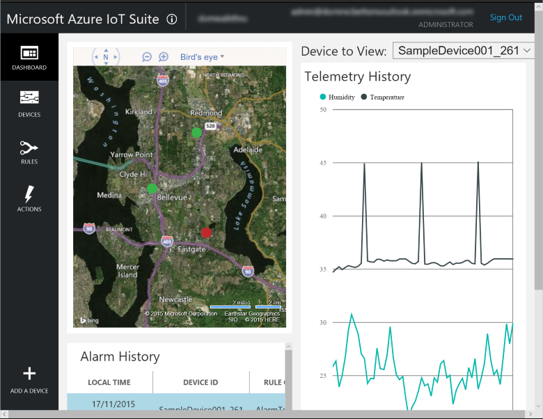
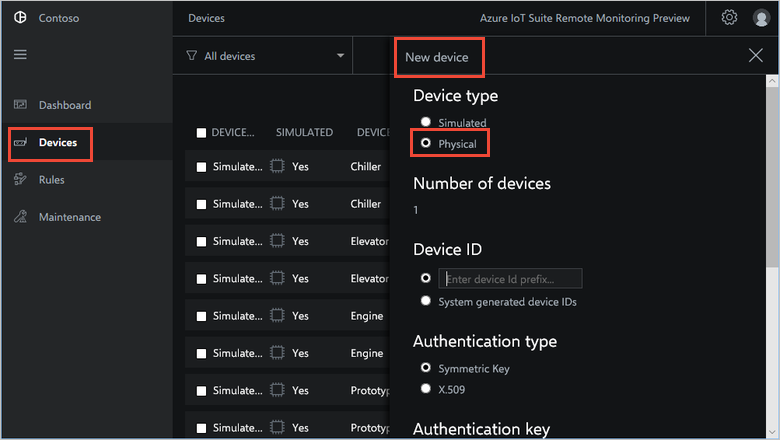
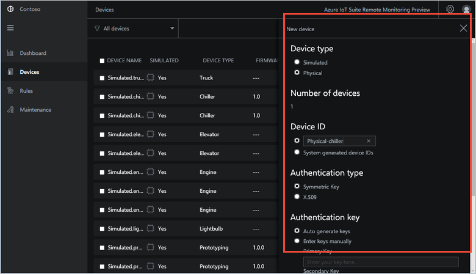
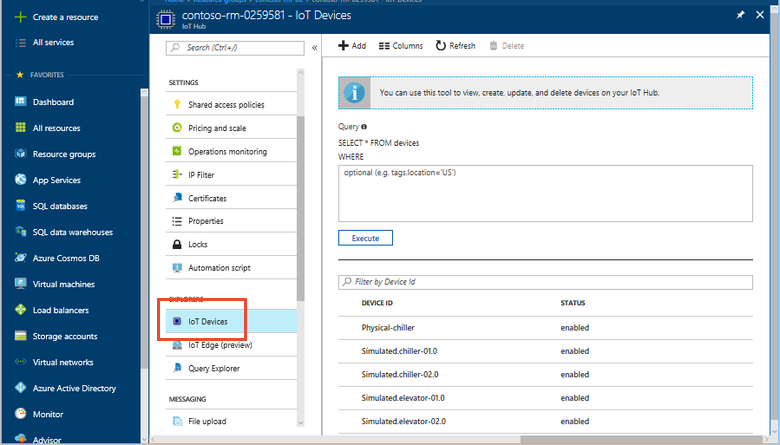

> [!div class="op_single_selector"]
> * [C on Windows](../articles/iot-suite/iot-suite-connecting-devices.md)
> * [C on Linux](../articles/iot-suite/iot-suite-connecting-devices-linux.md)
> * [Node.js (generic)](../articles/iot-suite/iot-suite-connecting-devices-node.md)
> * [Node.js on Raspberry Pi](../articles/iot-suite/iot-suite-connecting-pi-node.md)
> * [C on Raspberry Pi](../articles/iot-suite/iot-suite-connecting-pi-c.md)

In this tutorial, you implement a **Chiller** device that sends the following telemetry to the remote monitoring [preconfigured solution](../articles/iot-suite/iot-suite-what-are-preconfigured-solutions.md):

* Temperature
* Pressure
* Humidity

For simplicity, the code generates sample telemetry values for the **Chiller**. You could extend the sample by connecting real sensors to your device and sending real telemetry.

The sample device also:

* Sends metadata to the solution to describe its capabilities.
* Responds to actions triggered from the **Devices** page in the solution.
* Responds to configuration changes send from the **Devices** page in the solution.

To complete this tutorial, you need an active Azure account. If you don't have an account, you can create a free trial account in just a couple of minutes. For details, see [Azure Free Trial](http://azure.microsoft.com/pricing/free-trial/).

## Before you start

Before you write any code for your device, you must provision your remote monitoring preconfigured solution and provision a new custom device in that solution.

### Provision your remote monitoring preconfigured solution

The **Chiller** device you create in this tutorial sends data to an instance of the [remote monitoring](../articles/iot-suite/iot-suite-remote-monitoring-explore.md) preconfigured solution. If you haven't already provisioned the remote monitoring preconfigured solution in your Azure account, see [Deploy the remote monitoring preconfigured solution](../articles/iot-suite/iot-suite-remote-monitoring-deploy.md)

When the provisioning process for the remote monitoring solution finishes, click **Launch** to open the solution dashboard in your browser.

### Provision your device in the remote monitoring solution

> [!NOTE]
> If you have already provisioned a device in your solution, you can skip this step. You need the device credentials when you create the client application.

For a device to connect to the preconfigured solution, it must identify itself to IoT Hub using valid credentials. You can retrieve the device credentials from the solution **Devices** page. You include the device credentials in your client application later in this tutorial.

To add a device to your remote monitoring solution, complete the following steps on the **Devices** page in the solution:

1. Choose **Provision**, and then choose **Physical** as the **Device type**:

    

1. Enter **Physical-chiller** as the Device ID. Choose the **Symmetric Key** and **Auto generate keys** options:

    

To locate the credentials your device must use to connect to the preconfigured solution, navigate to the Azure portal in your browser. Sign in to your subscription.

1. Locate the resource group that contains the Azure services your remote monitoring solution uses. The resource group has the same name as the remote monitoring solution you provisioned.

1. Navigate to the IoT hub in this resource group. Then choose **Device explorer**:

    

1. Choose the **Device ID** you created on the **Devices** page in the remote monitoring solution.

1. Make a note of the **Device ID** and **Primary key** values. You use these values when you add code to connect your device to the solution.

You have now provisioned a physical device in the remote monitoring preconfigured solution. In the following sections, you implement the client application that uses the device credentials to connect to your solution.

The client application implements the built-in **Chiller** device model. A preconfigured solution device model specifies the following about a device:

* The properties the device reports to the solution. For example, a **Chiller** device reports information about its firmware and location.
* The types of telemetry the device sends to the solution. For example, a **Chiller** device sends temperature, humidity, and pressure values.
* The methods you can schedule from the solution to run on the device. For example, a **Chiller** device must implement **Reboot**, **FirmwareUpdate**, **EmergencyValveRelease**, and **IncreasePressuree** methods.