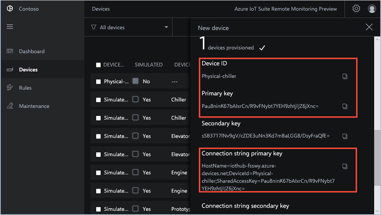

> [!div class="op_single_selector"]
> * [C on Windows](../articles/iot-suite/iot-suite-connecting-devices.md)
> * [C on Linux](../articles/iot-suite/iot-suite-connecting-devices-linux.md)
> * [Node.js (generic)](../articles/iot-suite/iot-suite-connecting-devices-node.md)
> * [Node.js on Raspberry Pi](../articles/iot-suite/iot-suite-connecting-pi-node.md)
> * [C on Raspberry Pi](../articles/iot-suite/iot-suite-connecting-pi-c.md)

In this tutorial, you implement a **Chiller** device that sends the following telemetry to the remote monitoring [solution accelerator](../articles/iot-suite/iot-suite-what-are-solution-accelerators.md):

* Temperature
* Pressure
* Humidity

For simplicity, the code generates sample telemetry values for the **Chiller**. You could extend the sample by connecting real sensors to your device and sending real telemetry.

The sample device also:

* Sends metadata to the solution to describe its capabilities.
* Responds to actions triggered from the **Devices** page in the solution.
* Responds to configuration changes send from the **Devices** page in the solution.

To complete this tutorial, you need an active Azure account. If you don't have an account, you can create a free trial account in just a couple of minutes. For details, see [Azure Free Trial](http://azure.microsoft.com/pricing/free-trial/).

## Before you start

Before you write any code for your device, deploy your remote monitoring solution accelerator and add a new physical device to the solution.

### Deploy your remote monitoring solution accelerator

The **Chiller** device you create in this tutorial sends data to an instance of the [remote monitoring](../articles/iot-suite/iot-suite-remote-monitoring-explore.md) solution accelerator. If you haven't already provisioned the remote monitoring solution accelerator in your Azure account, see [Deploy the remote monitoring solution accelerator](../articles/iot-suite/iot-suite-remote-monitoring-deploy.md)

When the deployment process for the remote monitoring solution finishes, click **Launch** to open the solution dashboard in your browser.

### Add your device to the remote monitoring solution

> [!NOTE]
> If you have already added a device in your solution, you can skip this step. However, the next step requires your device connection string. You can retrieve a device's connection string from the [Azure portal](https://portal.azure.com) or using the [az iot](https://docs.microsoft.com/cli/azure/iot?view=azure-cli-latest) CLI tool.

For a device to connect to the solution accelerator, it must identify itself to IoT Hub using valid credentials. You have the opportunity to save the device connection string that contains these credentials when you add the device the solution. You include the device connection string in your client application later in this tutorial.

To add a device to your remote monitoring solution, complete the following steps on the **Devices** page in the solution:

1. Choose **+ New device**, and then choose **Physical** as the **Device type**:

    

1. Enter **Physical-chiller** as the Device ID. Choose the **Symmetric Key** and **Auto generate keys** options:

    

1. Choose **Apply**. Then make a note of the **Device ID**, **Primary Key**, and **Connection string primary key** values:

    

You've now added a physical device to the remote monitoring solution accelerator and noted its device connection string. In the following sections, you implement the client application that uses the device connection string to connect to your solution.

The client application implements the built-in **Chiller** device model. A solution accelerator device model specifies the following about a device:

* The properties the device reports to the solution. For example, a **Chiller** device reports information about its firmware and location.
* The types of telemetry the device sends to the solution. For example, a **Chiller** device sends temperature, humidity, and pressure values.
* The methods you can schedule from the solution to run on the device. For example, a **Chiller** device must implement **Reboot**, **FirmwareUpdate**, **EmergencyValveRelease**, and **IncreasePressure** methods.