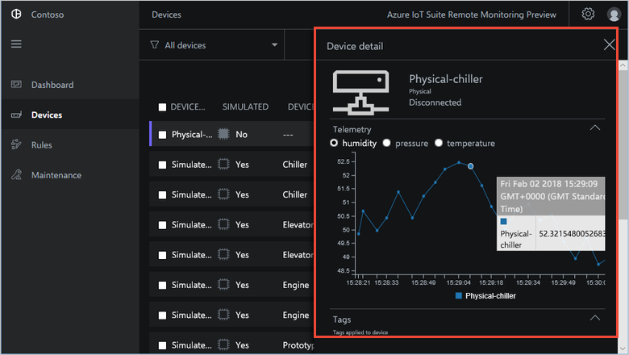
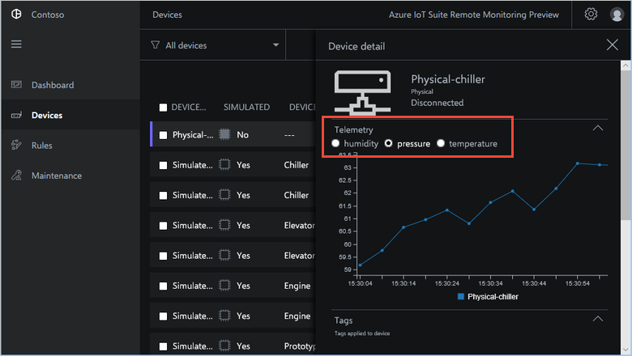
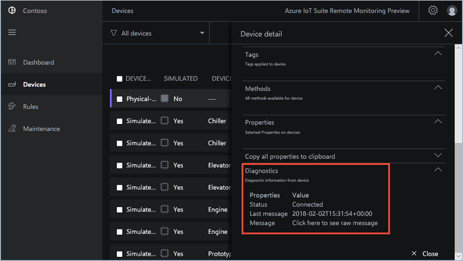
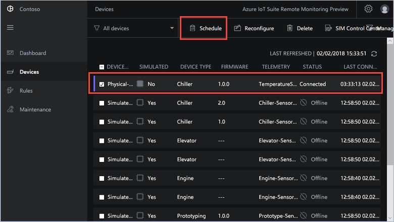
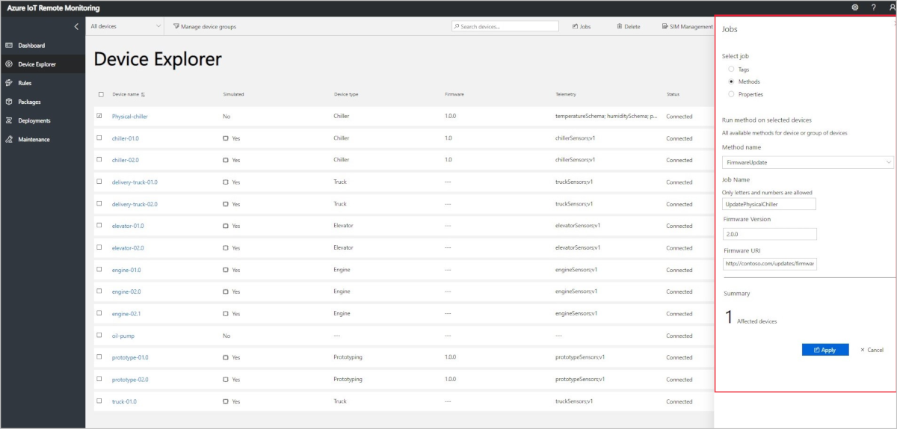

## View device telemetry

You can view the telemetry sent from your device on the **Device Explorer** page in the solution.

1. Select the device you provisioned in the list of devices on the **Device Explorer** page. A panel displays information about your device including a plot of the device telemetry:

    

1. Choose **Pressure** to change the telemetry display:

    

1. To view diagnostic information about your device, scroll down to **Diagnostics**:

    

## Act on your device

To invoke methods on your devices, use the **Device Explorer** page in the Remote Monitoring solution. For example, in the Remote Monitoring solution **Chiller** devices implement a **Reboot** method.

1. Choose **Devices** to navigate to the **Device Explorer** page in the solution.

1. Select the device you provisioned in the list of devices on the **Device Explorer** page:

    

1. To display a list of the methods you can call on your device, choose **Jobs**, then **Methods**. To schedule a job to run on multiple devices, you can select multiple devices in the list. The **Jobs** panel shows the types of method common to all the devices you selected.

1. Choose **Reboot**, set the job name to **RebootPhysicalChiller** and then choose **Apply**:

    

1. A sequence of messages displays in the console running your device code while the simulated device handles the method.

> [!NOTE]
> To track the status of the job in the solution, choose **View Job Status**.

## Next steps

The article [Customize the Remote Monitoring solution accelerator](../articles/iot-accelerators/iot-accelerators-remote-monitoring-customize.md) describes some ways to customize the solution accelerator.