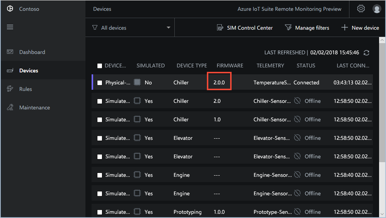

## View device telemetry

You can view the telemetry sent from your device on the **Devices** page in the solution.

1. Select the device you provisioned in the list of devices on the **Devices** page. A panel displays information about your device including a plot of the device telemetry:

    

1. Choose **Pressure** to change the telemetry display:

    

1. To view diagnostic information about your device, scroll down to **Diagnostics**:

    

## Act on your device

To invoke methods on your devices, use the **Devices** page in the Remote Monitoring solution. For example, in the Remote Monitoring solution **Chiller** devices implement a **FirmwareUpdate** method.

1. Choose **Devices** to navigate to the **Devices** page in the solution.

1. Select the device you provisioned in the list of devices on the **Devices** page:

    

1. To display a list of the methods you can call on your device, choose **Jobs**, then **Run method**. To schedule a job to run on multiple devices, you can select multiple devices in the list. The **Jobs** panel shows the types of method common to all the devices you selected.

1. Choose **FirmwareUpdate**, set the job name to **UpdatePhysicalChiller**. Set **Firmware Version** to **2.0.0**, set **Firmware URI** to **http://contoso.com/updates/firmware.bin**, and then choose **Apply**:

    

1. A sequence of messages displays in the console running your device code while the simulated device handles the method.

1. When the update is complete, the new firmware version displays on the **Devices** page:

    

> [!NOTE]
> To track the status of the job in the solution, choose **View**.

## Next steps

The article [Customize the Remote Monitoring solution accelerator](../articles/iot-accelerators/iot-accelerators-remote-monitoring-customize.md) describes some ways to customize the solution accelerator.