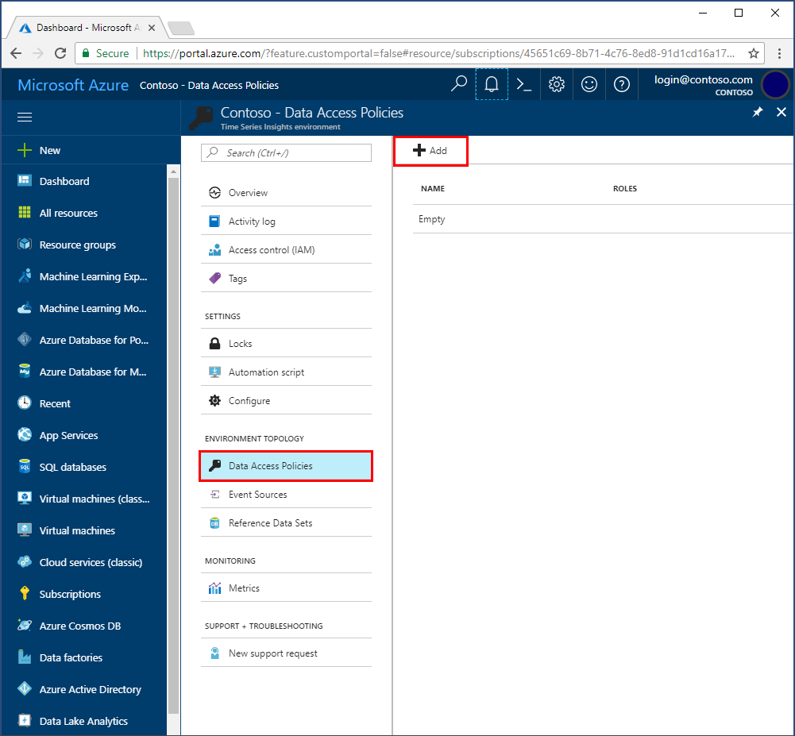
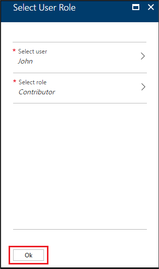

## Grant data access

Follow these steps to grant data access for a user principal:

1. Sign in to the [Azure portal](https://portal.azure.com).

2. Locate your Time Series Insights environment. Type **Time Series** in the **search** box. Select **Time Series Environment** in the search results. 

3. Select your Time Series Insights environment from the list.

4. Select **Data Access Policies**, then select **+ Add**.
    

5. Select **Select user**.  Search for the user name or email address to locate the user you want to add. Click **Select** to confirm the selection. 

    

6. Select **Select role**. Choose the appropriate access role for the user:
    - Select **Contributor** if you want to allow user to change reference data and share saved queries and perspectives with other users of the environment. 
    - Otherwise, select **Reader** to allow user query data in the environment and save personal (not shared) queries in the environment.

    Select **Ok** to confirm the role choice.

    

7. Select **Ok** in the **Select User Role** page.

    

8. The **Data Access Policies** page lists the users and the role(s) for each user.

    