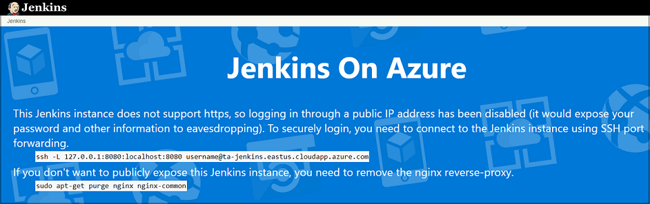
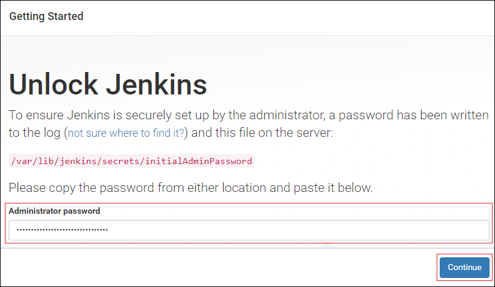
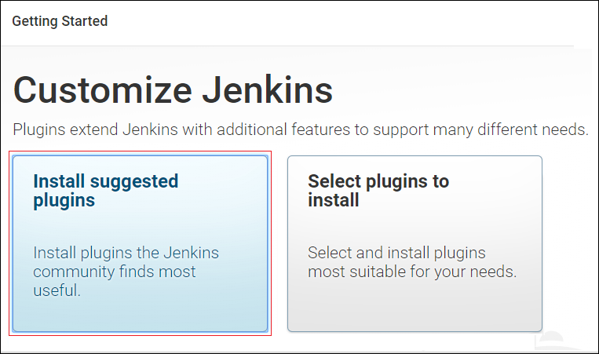
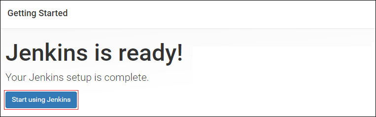

1. In your browser, navigate to your Jenkins virtual machine. Since the Jenkins dashboard is inaccessible through unsecured HTTP, a message displays indicating that you need to use SSH to tunnel into the virtual machine.

    

1. Open a bash or terminal window, with access to SSH.

1. Enter the following `ssh` command, replacing the **&lt;username>** and **&lt;domain>** placeholders with the values specified when creating the Jenkins virtual machine:

    ```bash
    ssh -L 127.0.0.1:8080:localhost:8080 <username>@<domain>.eastus.cloudapp.azure.com
    ```

1. Follow the `ssh` prompts to sign in to the Jenkins virtual machine.

1. Enter the following command to retrieve the initial password for unlocking Jenkins.

    ```bash
    sudo cat /var/lib/jenkins/secrets/initialAdminPassword
    ```

1. Copy to the clipboard the password that is displayed in the bash or terminal window.

1. In your browser, navigate to `http://localhost:8080`.

1. Paste the password retrieved earlier into the **Administrative password** field, and select **Continue**.

    

1. Select **Install suggested plugins**.

    

1. On the **Create First Admin User** page, create the administrative user and password for the Jenkins dashboard, and select **Save and finish**.

1. On the **Jenkins is ready!** page, select **Start using Jenkins**.

    