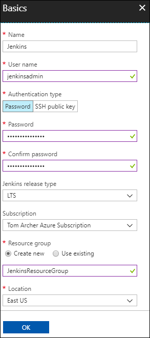
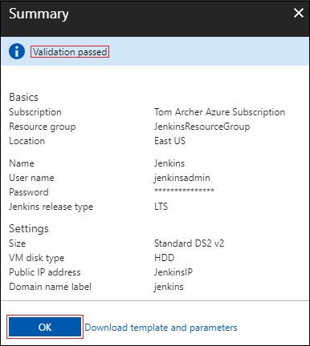

1. In your browser, open the [Azure Marketplace image for Jenkins](https://azuremarketplace.microsoft.com/marketplace/apps/azure-oss.jenkins?tab=Overview).

1. Select **GET IT NOW**.

    

1. After reviewing the pricing details and terms information, select **Continue**.

    

1. Select **Create** to configure the Jenkins server in the Azure portal. 

    

1. In the **Basics** tab, specify the following values:

    - **Name** - Enter `Jenkins`.
    - **User** - Enter the user name to use when signing into the VM on which Jenkins is running.
    - **Authentication type** - Select **Password**.
    - **Password** - Enter the password to use when signing into the VM on which Jenkins is running.
    - **Confirm password** - Reenter the password to use when signing into the VM on which Jenkins is running.
    - **Jenkins release type** - Select **LTS**.
    - **Subscription** - Select the Azure subscription into which you want to install Jenkins.
    - **Resource group** - Select **Create new**, and enter a name for the resource group that server as a logical container for the collection of resources that make up your Jenkins installation.
    - **Location** - Select **East US**.

    

1. Select **OK** to proceed to the **Settings** tab. 

1. In the **Settings** tab, specify the following values:

    - **Size** - Select the appropriate sizing option for your Jenkins VM.
    - **VM disk type** - Specify either HDD (hard-disk drive) or SSD (solid-state drive) to indicate which storage disk type is allowed for the Jenkins VM.
    - **Public IP address** - The IP address name defaults to the Jenkins name you specified in the previous page with a suffix of -IP. You can select the option to change that default.
    - **Domain name label** - Specify the value for the fully qualified URL to the Jenkins VM.

    

1. Select **OK** to proceed to the **Summary** tab.

1. When the **Summary** tab displays, the information entered is validated. Once you see the **Validation passed** message, select **OK**. 

    

1. When the **Create** tab displays, select **Create** to create the Jenkins VM. When your server is ready, a notification displays in the Azure portal.

    

## Connect to Jenkins

Navigate to your virtual machine (for example, http://jenkins2517454.eastus.cloudapp.azure.com/) in  your web browser. The Jenkins console is inaccessible through unsecured HTTP so instructions are provided on the page to access the Jenkins console securely from your computer using an SSH tunnel.


Set up the tunnel using the `ssh` command on the page from the command line, replacing `username` with the name of the virtual machine admin user chosen earlier when setting up the virtual machine from the solution template.

```bash
ssh -L 127.0.0.1:8080:localhost:8080 jenkinsadmin@jenkins2517454.eastus.cloudapp.azure.com
```

After you have started the tunnel, navigate to http://localhost:8080/ on your local machine. 

Get the initial password by running the following command in the command line while connected through SSH to the Jenkins VM.

```bash
`sudo cat /var/lib/jenkins/secrets/initialAdminPassword`.
```

Unlock the Jenkins dashboard for the first time using this initial password.


Select **Install suggested plugins** on the next page and then create a Jenkins admin user used to access the Jenkins dashboard.


The Jenkins server is now ready to build code.
