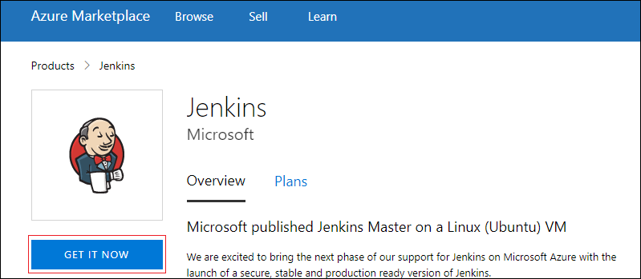
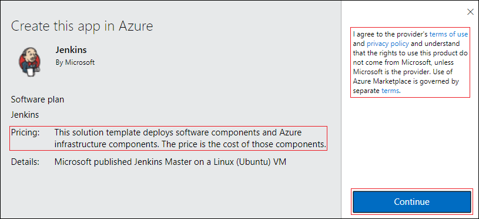
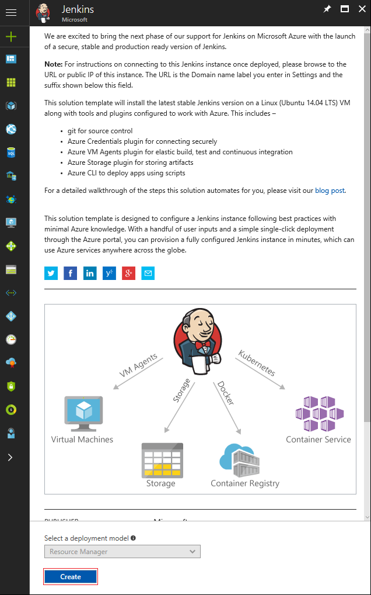
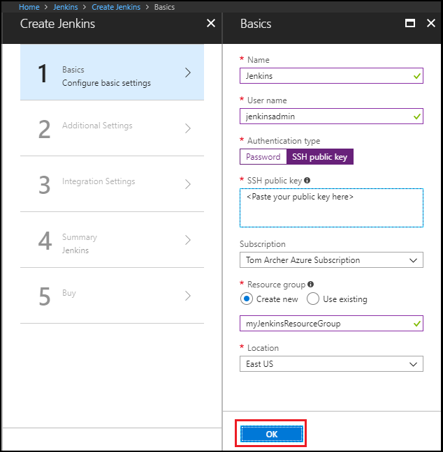
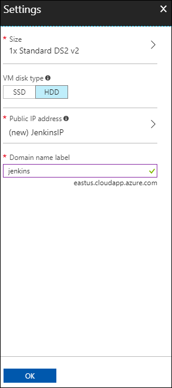
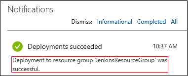

1. In your browser, open the [Azure Marketplace image for Jenkins](https://azuremarketplace.microsoft.com/marketplace/apps/azure-oss.jenkins?tab=Overview).

1. Select **GET IT NOW**.

    

1. After reviewing the pricing details and terms information, select **Continue**.

    

1. Select **Create** to configure the Jenkins server in the Azure portal. 

    

1. In the **Basics** tab, specify the following values:

   - **Name** - Enter `Jenkins`.
   - **User name** - Enter the user name to use when signing in to the virtual machine on which Jenkins is running. The user name must meet [specific requirements](/azure/virtual-machines/linux/faq#what-are-the-username-requirements-when-creating-a-vm).
   - **Authentication type** - Select **SSH public key**.
   - **SSH public key** - Copy and paste an RSA public key in single-line format (starting with `ssh-rsa`) or multi-line PEM format. You can generate SSH keys using ssh-keygen on Linux and macOS, or PuTTYGen on Windows. For more information about SSH keys and Azure, see the article, [How to Use SSH keys with Windows on Azure](/azure/virtual-machines/linux/ssh-from-windows).
   - **Subscription** - Select the Azure subscription into which you want to install Jenkins.
   - **Resource group** - Select **Create new**, and enter a name for the resource group that serves as a logical container for the collection of resources that make up your Jenkins installation.
   - **Location** - Select **East US**.

     

1. Select **OK** to proceed to the **Additional Settings** tab. 

1. In the **Additional Settings** tab, specify the following values:

   - **Size** - Select the appropriate sizing option for your Jenkins virtual machine.
   - **VM disk type** - Specify either HDD (hard-disk drive) or SSD (solid-state drive) to indicate which storage disk type is allowed for the Jenkins virtual machine.
   - **Virtual network** - (Optional) Select **Virtual network** to modify the default settings.
   - **Subnets** - Select **Subnets**, verify the information, and select **OK**.
   - **Public IP address** - The IP address name defaults to the Jenkins name you specified in the previous page with a suffix of -IP. You can select the option to change that default.
   - **Domain name label** - Specify the value for the fully qualified URL to the Jenkins virtual machine.
   - **Jenkins release type** - Select the desired release type from the options: `LTS`, `Weekly build`, or `Azure Verified`. The `LTS` and `Weekly build` options are explained in the article, [Jenkins LTS Release Line](https://jenkins.io/download/lts/). The `Azure Verified` option refers to a [Jenkins LTS version](https://jenkins.io/download/lts/) that has been verified to run on Azure. 
   - **JDK Type** - JDK to be installed. Default is Zulu tested, certified builds of OpenJDK.

     

1. Select **OK** to proceed to the **Integration Settings** tab.

1. In the **Integration Settings** tab, specify the following values:

    - **Service Principal** - The service principal is added into Jenkins as a credential for authentication with Azure. `Auto` means that the principal will be created by MSI (Managed Service Identity). `Manual` means that the principal should be created by you. 
        - **Application ID** and **Secret** - If you select the `Manual` option for the **Service Principal** option, you'll need to specify the `Application ID` and `Secret` for your service principal. When [creating a service principal](/cli/azure/create-an-azure-service-principal-azure-cli), note that the default role is **Contributor**, which is sufficient for working with Azure resources.
    - **Enable Cloud Agents** - Specify the default cloud template for agents where `ACI` refers to Azure Container Instance, and `VM` refers to virtual machines. You can also specify `No` if you don't wish to enable a cloud agent.

1. Select **OK** to proceed to the **Summary** tab.

1. When the **Summary** tab displays, the information entered is validated. Once you see the **Validation passed** message (at the top of the tab), select **OK**. 

     

1. When the **Create** tab displays, select **Create** to create the Jenkins virtual machine. When your server is ready, a notification displays in the Azure portal.

     
