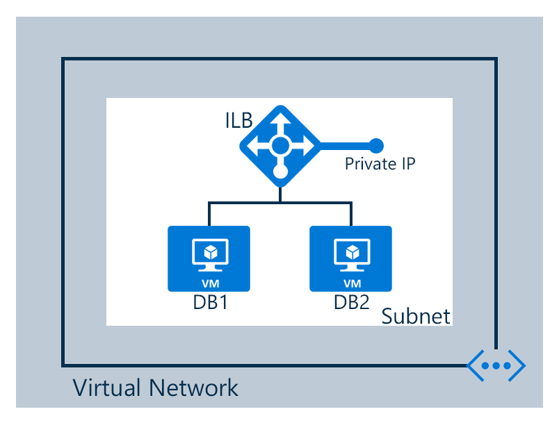

## Configuration scenario

In this scenario, we're creating an internal load balancer in a virtual network as shown in the following figure:

The configuration for our scenario is as follows:

* Two virtual machines named **DB1** and **DB2**
* Endpoints for the internal load balancer
* An internal load balancer
