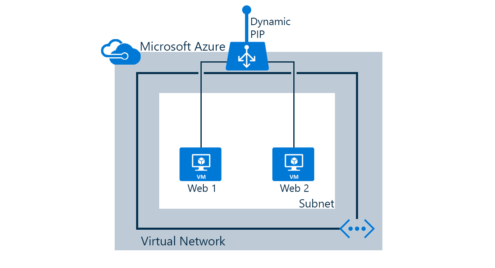

The following tasks will be done in this scenario:

* Create a load balancer that receives network traffic on port 80 and send load-balanced traffic to virtual machines "web1" and "web2"
* Create NAT rules for remote desktop access/SSH for virtual machines behind the load balancer
* Create health probes

