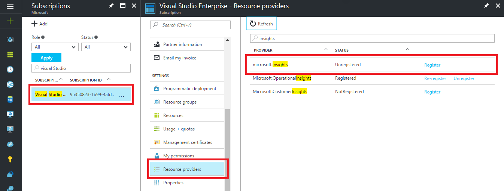

### Troubleshoot Azure Diagnostics

If you receive the following error message, the Microsoft.insights resource provider is not registered:

`Failed to update diagnostics for 'resource'. {"code":"Forbidden","message":"Please register the subscription 'subscription id' with Microsoft.Insights."}`

To register the resource provider, perform the following steps in the Azure portal:

1.	In the navigation pane on the left, click *Subscriptions*
2.	Select the subscription identified in the error message
3.	Click *Resource Providers*
4.	Find the *Microsoft.insights* provider
5.	Click the *Register* link

Once the *Microsoft.insights* resource provider is registered, retry configuring diagnostics.

In PowerShell, if you receive the following error message, you need to update your version of PowerShell:

`Set-AzureRmDiagnosticSetting : A parameter cannot be found that matches parameter name 'WorkspaceId'.`

Update your version of PowerShell to the November 2016 (v2.3.0), or later, release using the instructions in the [Get started with Azure PowerShell cmdlets](https://docs.microsoft.com/powershell/azureps-cmdlets-docs/) article.
