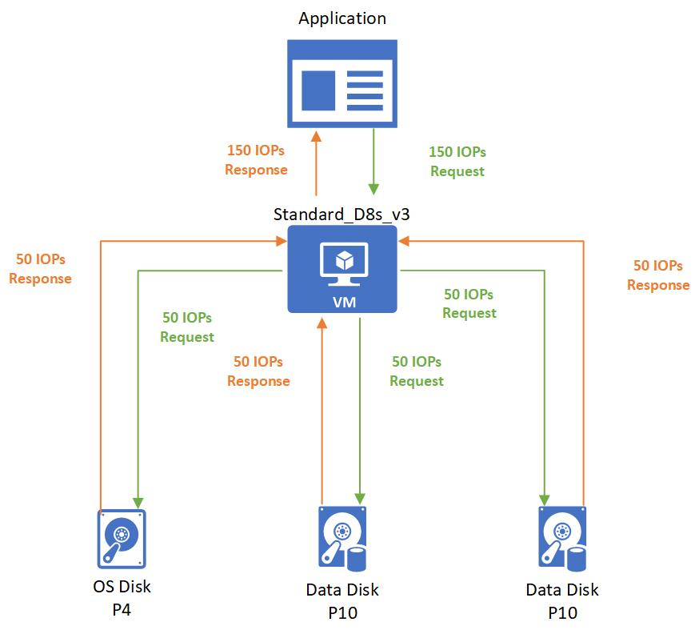
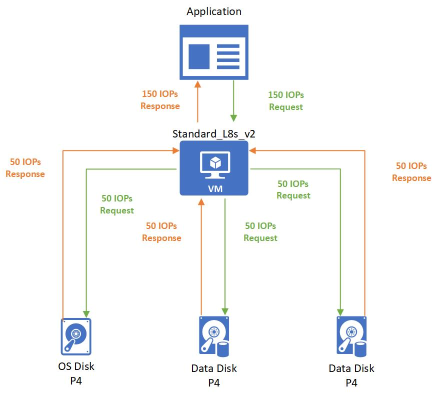

## Enabling Bursting
The bursting feature is enabled by default for new deployments. You don't need to do anything but start your new virtual machine or attach your new disk to get this benefit. With an existing virtual machine deployment, you need to do is restart your virtual machine to get the bursting feature enabled. With an existing attached disk, you can do one of two things to get bursting enabled: 
- **Restart the VM** 
- **Reattach the disk**

## Example Scenarios
Here are a couple of scenarios where bursting really comes to save the day:
- **Cost Savings** – No longer do you need to plan to provision your IaaS solution for the peak disk IO performance. You can now provision your virtual machine and disks to meet their average disk IO use. With bursting it can also meet its peak performance needs.
- **Improving boot times**  – With full burst credits at run time, your instance will be able to boot at a much faster rate than before! For example, the default OS disk for premium enabled VMs is the P4 disk, which is a provisioned performance of up to 120 IOPS and 25 MB/s. With bursting, the P4 can go up to 3500 IOPS and 170 MB/s allowing for a boot time to accelerate by 6X.
- **Handling batch jobs** – Some application’s workloads are cyclical in nature and require a baseline performance for most of the time and require higher performance for a short period of time. An example of this is an accounting program that process transactions daily that require a small amount of disk traffic. Then at the end of the month, does reconciling reports that need a much higher amount of disk traffic.
- **Preparedness for traffic spikes** – Web servers and their applications can get a surge of traffic from unforeseen circumstances. With bursting virtual machines and disks backing the web servers, the web servers will handle traffic spikes smoothly and improve their customer’s experience by reducing load times under heavy stress. 

## Bursting Flow
The bursting credit system applies in the same manner at both the virtual machine level and disk level. Your resource, either a VM or disk, will start with fully stocked credits. These credits will allow you to burst for 30 minutes at the maximum burst rate. Bursting credits accumulate when your resource is running under their provisioned disk storage limits. For every IOP and MB/s that your resource is using below the provisioned limit you begin to accumulate credits. If your resource has accrued credits to use for bursting and your workload needs the extra performance, your resource can use those credits to go above your provisioned limit to give it the disk IO performance it needs to meet the demand.

One thing to note about burst accumulation is that it is different for each resource since it is based on the unused IOPS and MB/s below their provisioned amounts. This means that higher baseline performance products can accrue their bursting amounts faster than lower baseline performing products. For example, a P1 SSD idling with no activity will accrue 120 IOPS per second whereas a P20 will accrues 2,300 IOPS per second while idling with no activity.

## Bursting States
There are three states your resource can be in with bursting enabled:
- **Accruing** – The resource’s IO traffic is using less than the provisioned performance target. Accumulating bursting credits for IOPS and MB/s are done separate from one another. Your resource can be accruing IOPS credits and spending MB/s credits or vice versa.
- **Bursting** – The resource’s traffic is using more than the provisioned performance target. The burst traffic will independently consume credits from IOPS or bandwidth.
- **Constant** – The resource’s traffic is exactly at the provisioned performance target.

## Examples of Bursting
Let us run through some example of bursting with different virtual machine and disk combination to solidify how this feature works. To make these examples easy to follow, we will focus only on IOPS but the same logic is applied independently to throughput.

### Non-Burstable Virtual Machine with Burstable Disks
**VM and Disk Combination:** 
- Standard_D8as_v4 
    - Provisioned IOPS: 12,800
- P4 OS Disk
    - Provisioned IOPS: 120
    - Max Burst IOPS: 3,500 
- 2 P10 Data Disks 
    - Provisioned IOPS: 500
    - Max Burst IOPS: 3,500

You might consider this solution if you are not concerned about storage space and are looking for good performance out of your VM’s application. When the VM boots up it will retrieve data from the OS disk. Since the OS disk is part of a VM that is getting started, the OS disk will be full of bursting credits. These credits will alow the OS disk burst its startup at 3,500 IOP/s second as seen below:

After the boot up is complete, an application is then run on the VM and has a non-critical workload. This workload requires 150 IOPS that gets spread evenly across all the disks:

Then the application needs to process a batched job that requires 7,500 IOPS. 500 IOPS are used by the OS Disk and the rest are evenly split between the data disks:

### Burstable Virtual Machine with Non-Burstable Disks
**VM and Disk Combination:** 
- Standard_L8s_v2 
    - Provisioned IOPS: 8,000
    - Max Burst IOPS: 64,000
- P50 OS Disk
    - Provisioned IOPS: 7,500 
- 2 P10 Data Disks 
    - Provisioned IOPS: 7,500

You might want to consider this solution if you need the extra storage as a P50 disk is 4 TB in size.  After the initial boot up, an application is run on the VM and has a non-critical workload. This workload requires 3,000 IOPS that gets spread evenly across all the disks:

Then the application needs to process a batched job that requires 21,000 IOPS. The Standard_L8s_v2 bursts to meet this demand and then requests to the disks get evenly spread out to P50 disks:

### Burstable Virtual Machine with Burstable Disks
**VM and Disk Combination:** 
- Standard_L8s_v2 
    - Provisioned IOPS: 8,000
    - Max Burst IOPS: 64,000
- P4 OS Disk
    - Provisioned IOPS: 120
    - Max Burst IOPS: 3,500 
- 2 P4 Data Disks 
    - Provisioned IOPS: 120
    - Max Burst IOPS: 3,500 

 You might consider a solution like this if your workload is cyclical in nature. This way your IaaS solution can burst to meet your peak workload while being price conscious. One of the P4 is an OS disk and the remaining 2 are data disks that contain data for an application. When the VM boots up, it will burst to request its burst limit of 64,000 IOPS from the OS disk and the OS disk will respond with its burst performance of 3,700 IOPS:

Then after the boot up is complete, an application is then run on the VM. The application has a non-critical workload that requires 150 IOPS that gets spread evenly across all the disks:

Then the application needs to process a batched job that requires 7,500 IOPS. The Standard_L8s_v2 bursts to meet this demand and then requests. Only 500 of these IOPS are needed by the OS disk. The remaining 7,000 IOPS are handled by the bursting P4 data disks:
