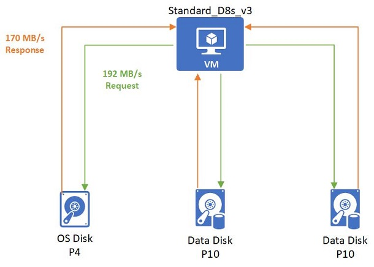
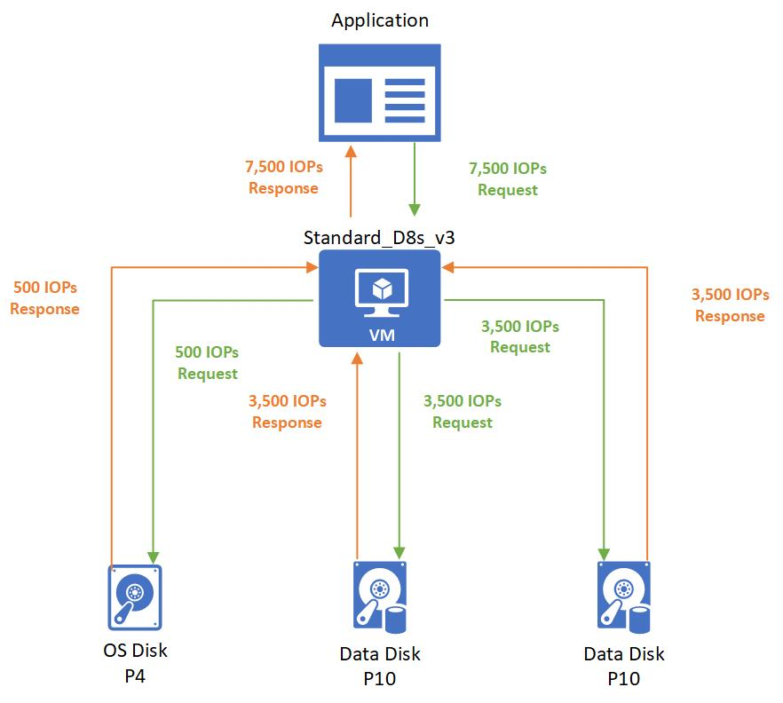

## Common scenarios
The following scenarios can benefit greatly from bursting:
- **Improving boot times**  – With bursting, your instance will boot at a significantly faster rate. For example, the default OS disk for premium enabled VMs is the P4 disk, which is a provisioned performance of up to 120 IOPS and 25 MB/s. With bursting, the P4 can go up to 3500 IOPS and 170 MB/s allowing for a boot time to accelerate by 6X.
- **Handling batch jobs** – Some application’s workloads are cyclical in nature and require a baseline performance for most of the time and require higher performance for a short period of time. An example of this is an accounting program that process transactions daily that require a small amount of disk traffic. Then at the end of the month, does reconciling reports that need a much higher amount of disk traffic.
- **Preparedness for traffic spikes** – Web servers and their applications can experience traffic surges at any time. If your web server is backed by VMs or disks using bursting, the servers are better equipped to handle traffic spikes. 

## Bursting flow
The bursting credit system applies in the same manner at both the virtual machine level and disk level. Your resource, either a VM or disk, will start with fully stocked credits. These credits will allow you to burst for 30 minutes at the maximum burst rate. Bursting credits accumulate when your resource is running under their performance disk storage limits. For all IOPS and MB/s that your resource is using below the performance limit you begin to accumulate credits. If your resource has accrued credits to use for bursting and your workload needs the extra performance, your resource can use those credits to go above your performance limit to give it the disk IO performance it needs to meet the demand.

One thing to note about burst accumulation is that it is different for each resource since it is based on the unused IOPS and MB/s below their performance amounts. This means that higher baseline performance products can accrue their bursting amounts faster than lower baseline performing products. For example, a P1 disk idling with no activity will accrue 120 IOPS per second whereas a P20 disk accrues 2,300 IOPS per second while idling with no activity.

## Bursting states
There are three states your resource can be in with bursting enabled:
- **Accruing** – The resource’s IO traffic is using less than the performance target. Accumulating bursting credits for IOPS and MB/s are done separate from one another. Your resource can be accruing IOPS credits and spending MB/s credits or vice versa.
- **Bursting** – The resource’s traffic is using more than the performance target. The burst traffic will independently consume credits from IOPS or bandwidth.
- **Constant** – The resource’s traffic is exactly at the performance target.

## Examples of bursting
The following examples show how bursting works with various virtual machine and disk combinations. To make the examples easy to follow, we will focus on MB/s, but the same logic is applied independently to IOPS.

### Non-burstable virtual machine with burstable Disks
**VM and disk combination:** 
- Standard_D8as_v4 
    - Uncached MB/s: 192
- P4 OS Disk
    - Provisioned MB/s: 25
    - Max burst MB/s: 170 
- 2 P10 Data Disks 
    - Provisioned MB/s: 25
    - Max burst MB/s: 170

 When the VM boots up it will retrieve data from the OS disk. Since the OS disk is part of a VM that is getting started, the OS disk will be full of bursting credits. These credits will allow the OS disk burst its startup at 170 MB/s second as seen below:

After the boot up is complete, an application is then run on the VM and has a non-critical workload. This workload requires 15 MB/S that gets spread evenly across all the disks:

Then the application needs to process a batched job that requires 192 MB/s. 2 MB/s are used by the OS Disk and the rest are evenly split between the data disks:

### Burstable virtual machine with non-burstable disks
**VM and disk combination:** 
- Standard_L8s_v2 
    - Uncached MB/s: 160
    - Max burst MB/s: 1,280
- P50 OS Disk
    - Provisioned MB/s: 250 
- 2 P10 Data Disks 
    - Provisioned MB/s: 250

 After the initial boot up, an application is run on the VM and has a non-critical workload. This workload requires 30 MB/s that gets spread evenly across all the disks:

Then the application needs to process a batched job that requires 600 MB/s. The Standard_L8s_v2 bursts to meet this demand and then requests to the disks get evenly spread out to P50 disks:

### Burstable virtual machine with burstable Disks
**VM and disk combination:** 
- Standard_L8s_v2 
    - Uncached MB/s: 160
    - Max burst MB/s: 1,280
- P4 OS Disk
    - Provisioned MB/s: 25
    - Max burst MB/s: 170 
- 2 P4 Data Disks 
    - Provisioned MB/s: 25
    - Max burst MB/s: 170 

When the VM boots up, it will burst to request its burst limit of 1,280 MB/s from the OS disk and the OS disk will respond with its burst performance of 170 MB/s:

Then after the boot up is complete, an application is then run on the VM. The application has a non-critical workload that requires 15 MB/s that gets spread evenly across all the disks:

Then the application needs to process a batched job that requires 360 MB/s. The Standard_L8s_v2 bursts to meet this demand and then requests. Only 20 MB/s are needed by the OS disk. The remaining 340 MB/s are handled by the bursting P4 data disks:  

