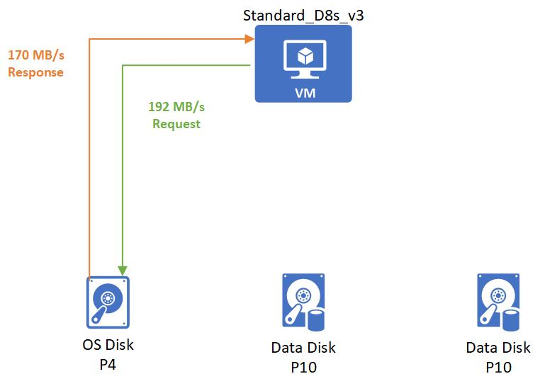

## Disk-level bursting

### On-demand bursting (preview)

Disks using the on-demand bursting model of disk bursting can burst beyond original provisioned targets, as often as needed by their workload, up to the max burst target. For example, on a 1-TiB P30 disk, the provisioned IOPS is 5000 IOPS. When disk bursting is enabled on this disk, your workloads can issue IOs to this disk up to the max burst performance of 30,000 IOPS and 1,000 MBps.

If you expect your workloads to frequently run beyond the provisioned perf target, disk bursting won't be cost-effective. In this case, we recommend that you change your disk's performance tier to a [higher tier](../articles/virtual-machines/disks-performance-tiers.md) instead, for better baseline performance. Review your billing details and assess that against the traffic pattern of your workloads.

Before you enable on-demand bursting, understand the following:

[!INCLUDE [managed-disk-bursting-regions-limitations](managed-disk-bursting-regions-limitations.md)]

#### Regional availability

[!INCLUDE [managed-disk-bursting-availability](managed-disk-bursting-availability.md)]

#### Billing

Disks using the on-demand bursting model are charged an hourly burst enablement flat fee and transaction costs apply to any burst transactions beyond the provisioned target. Transaction costs are charged using the pay-as-you go model, based on uncached disk IOs, including both reads and writes that exceed provisioned targets. The following is an example of disk traffic patterns over a billing hour:

Disk configuration: Premium SSD – 1 TiB (P30), Disk bursting enabled.

- 00:00:00 – 00:10:00 Disk IOPS below provisioned target of 5,000 IOPS 
- 00:10:01 – 00:10:10 Application issued a batch job causing the disk IOPS to burst at 6,000 IOPS for 10 seconds 
- 00:10:11 – 00:59:00 Disk IOPS below provisioned target of 5,000 IOPS 
- 00:59:01 – 01:00:00 Application issued another batch job causing the disk IOPS to burst at 7,000 IOPS for 60 seconds 

In this billing hour, the cost of bursting consists of two charges:

The first charge is the burst enablement flat fee of $X (determined by your region). This flat fee is always charged on the disk disregard of the attach status until it is disabled. 

Second is the burst transaction cost. Disk bursting occurred in two time slots. From 00:10:01 – 00:10:10, the accumulated burst transaction is (6,000 – 5,000) X 10 = 10,000. From 00:59:01 – 01:00:00, the accumulated burst transaction is (7,000 – 5,000) X 60 = 120,000. The total burst transactions are 10,000 + 120,000 = 130,000. Burst transaction cost will be charged at $Y based on 13 units of 10,000 transactions (based on regional pricing).

With that, the total cost on disk bursting of this billing hour equals to $X + $Y. The same calculation would apply for bursting over provisioned target of MBps. We translate the overage of MB to transactions with IO size of 256KB. If your disk traffic exceed both provisioned IOPS and MBps target, you can refer to the example below to calculate the burst transactions. 

Disk configuration: Premium SSD – 1 TB (P30), Disk bursting enabled.

- 00:00:01 – 00:00:05 Application issued a batch job causing the disk IOPS to burst at 10,000 IOPS and 300 MBps for five seconds.
- 00:00:06 – 00:00:10 Application issued a recovery job causing the disk IOPS to burst at 6,000 IOPS and 600 MBps for five seconds.

The burst transaction is accounted as the max number of transactions from either IOPS or MBps bursting. From 00:00:01 – 00:00:05, the accumulated burst transaction is max ((10,000 – 5,000), (300 - 200) * 1024 / 256)) * 5 = 25,000 transactions. From 00:00:06 – 00:00:10, the accumulated burst transaction is max ((6,000 – 5,000), (600 - 200) * 1024 / 256)) * 5 = 8,000 transactions. On top of that, you include the burst enablement flat fee to get the total cost for enabling on-demand based disk bursting. 

You can refer to the [Managed Disks pricing page](https://azure.microsoft.com/pricing/details/managed-disks/) for details on pricing and use [Azure Pricing Calculator](https://azure.microsoft.com/pricing/calculator/?service=storage) to make the assessment for your workload. 

To enable on-demand bursting, see [Enable on-demand bursting](../articles/virtual-machines/disks-enable-bursting.md).

### Credit-based bursting

Credit-based bursting is available for disk sizes P20 and smaller in all regions in Azure Public, Government, and China Clouds. By default, disk bursting is enabled on all new and existing deployments of supported disk sizes. VM-level bursting only uses credit-based bursting.

## Virtual machine-level bursting

VM-level bursting only uses the credit-based model for bursting, it is enabled by default for all VMs that support it.

VM-level bursting is enabled in all regions in the Azure Public Cloud on these supported sizes: 
- [Lsv2-series](../articles/virtual-machines/lsv2-series.md)
- [Dv3 and Dsv3-series](../articles/virtual-machines/dv3-dsv3-series.md)
- [Ev3 and Esv3-series](../articles/virtual-machines/ev3-esv3-series.md)

## Bursting flow

The bursting credit system applies in the same manner at both the VM level and disk level. Your resource, either a VM or disk, will start with fully stocked credits in its own burst bucket. These credits allow you to burst for up to 30 minutes at the maximum burst rate. You accumulate credits whenever the resource's IOPS or MB/s are being utilized below the resource's performance target. If your resource has accrued bursting credits and your workload needs the extra performance, your resource can use those credits to go above its performance limits and increase its performance to meet the workload demands.

How you spend your available credits is up to you. You can use your 30 minutes of burst credits consecutively or sporadically throughout the day. When resources are deployed they come with a full allocation of credits. When those deplete, it takes less than a day to restock. Credits can be spent at your discretion, the burst bucket does not need to be full in order for resources to burst. Burst accumulation varies depending on each resource, since it is based on unused IOPS and MB/s below their performance targets. Higher baseline performance resources can accrue their bursting credits faster than lower baseline performing resources. For example, a P1 disk idling will accrue 120 IOPS per second, whereas an idling P20 disk would accrue 2,300 IOPS per second.

## Bursting states
There are three states your resource can be in with bursting enabled:
- **Accruing** – The resource’s IO traffic is using less than the performance target. Accumulating bursting credits for IOPS and MB/s are done separate from one another. Your resource can be accruing IOPS credits and spending MB/s credits or vice versa.
- **Bursting** – The resource’s traffic is using more than the performance target. The burst traffic will independently consume credits from IOPS or bandwidth.
- **Constant** – The resource’s traffic is exactly at the performance target.

## Bursting examples

The following examples show how bursting works with various VM and disk combinations. To make the examples easy to follow, we will focus on MB/s, but the same logic is applied independently to IOPS.

### Non-burstable virtual machine with burstable disks
**VM and disk combination:** 
- Standard_D8as_v4 
    - Uncached MB/s: 192
- P4 OS Disk
    - Provisioned MB/s: 25
    - Max burst MB/s: 170 
- 2 P10 Data Disks 
    - Provisioned MB/s: 100
    - Max burst MB/s: 170

 When the VM boots up it retrieves data from the OS disk. Since the OS disk is part of a VM that is booting, the OS disk will be full of bursting credits. These credits will allow the OS disk burst its startup at 170 MB/s second.

After the boot up is complete, an application is then run on the VM and has a non-critical workload. This workload requires 15 MB/S that gets spread evenly across all the disks.

Then the application needs to process a batched job that requires 192 MB/s. 2 MB/s are used by the OS disk and the rest are evenly split between the data disks.

### Burstable virtual machine with non-burstable disks
**VM and disk combination:** 
- Standard_L8s_v2 
    - Uncached MB/s: 160
    - Max burst MB/s: 1,280
- P50 OS Disk
    - Provisioned MB/s: 250 
- 2 P10 Data Disks 
    - Provisioned MB/s: 250

 After the initial boot up, an application is run on the VM and has a non-critical workload. This workload requires 30 MB/s that gets spread evenly across all the disks.

Then the application needs to process a batched job that requires 600 MB/s. The Standard_L8s_v2 bursts to meet this demand and then requests to the disks get evenly spread out to P50 disks.

### Burstable virtual machine with burstable disks
**VM and disk combination:** 
- Standard_L8s_v2 
    - Uncached MB/s: 160
    - Max burst MB/s: 1,280
- P4 OS Disk
    - Provisioned MB/s: 25
    - Max burst MB/s: 170 
- 2 P4 Data Disks 
    - Provisioned MB/s: 25
    - Max burst MB/s: 170 

When the VM starts, it will burst to request its burst limit of 1,280 MB/s from the OS disk and the OS disk will respond with its burst performance of 170 MB/s.

After startup, you start an application that has a non-critical workload. This application requires 15 MB/s that gets spread evenly across all the disks.

Then the application needs to process a batched job that requires 360 MB/s. The Standard_L8s_v2 bursts to meet this demand and then requests. Only 20 MB/s are needed by the OS disk. The remaining 340 MB/s are handled by the bursting P4 data disks.

