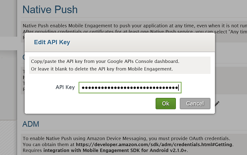
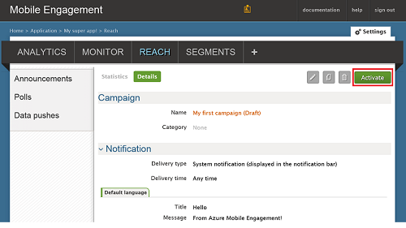

###Grant Mobile Engagement access to your GCM API Key

To allow Mobile Engagement to send push notifications on your behalf, you need to grant it access to your API Key. This is done by configuring and entering your key into the Mobile Engagement portal.

1. From your Azure Classic Portal, ensure you're in the app we're using for this project, and then click the **Engage** button at the bottom:

	

2. Then click the **Settings** -> **Native Push** section to enter your GCM Key:

	

3. Click the **Edit** icon in front of **API Key** in the **GCM Settings** section as shown below:

	

4. In the pop-up, paste the GCM Server Key you obtained before and then click **Ok**.

	

##Send a notification to your app

We will now create a simple push notification campaign that sends a push notification to our app.

1. Navigate to the **REACH** tab in your Mobile Engagement portal.

2. Click **New announcement** to create your push notification campaign.

	

3. Set up the first field of your campaign through the following steps:

	

	a. Name your campaign.

	b. Select the **Delivery type** as *System notification -> Simple*: This is the simple Android push notification type that features a title and a small line of text.

	c. Select **Delivery time** as *Any time* to allow the app to receive a notification whether the app is started or not.

	d. In the notification text type the **Title** which will be in bold in the push.

	e. Then type your **Message**

4. Scroll down, and in the **Content** section, select **Notification only**.

	

5. You're done setting the most basic campaign possible. Now scroll down again and click the **Create** button to save your campaign.

6. Last step: click **Activate** to activate your campaign to send push notifications.

	