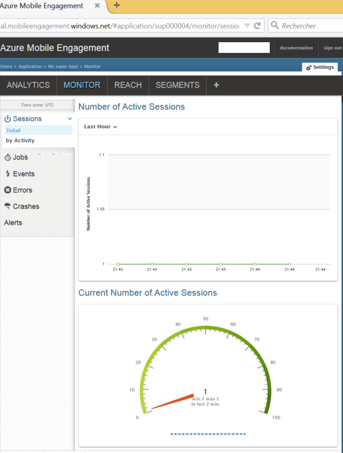

This section shows you how to connect your app to the Mobile Engagement backend by using the Mobile Engagement's real-time monitoring feature. 

1. In your **Azure Mobile Engagement** account, make sure you select the app you wish to monitor and manage in the **Mobile Engagement** portal. Navigate to your Mobile Engagement portal by clicking the **Engage** button at the bottom. 

	 

2. You will land in the Mobile Engagement portal. If the Monitor tab is not selected, click on the **Monitor**.

3. The monitor is ready to show you any device in real time, which will start your app.
	 
4. Start your app now. You should see one session in the monitor if your integration is correct which means that your app is now connected to the Mobile Engagement backend and is sending data to it.  
	
	 

