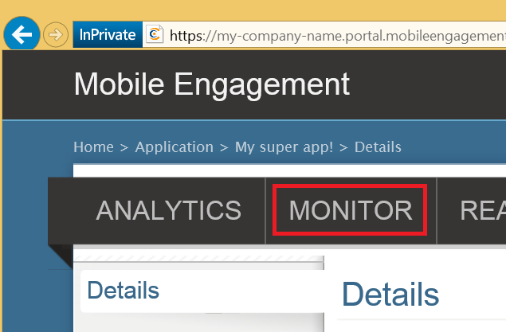

This section shows you how to make sure that your app connects to the Mobile Engagement backend by using the Mobile Engagement's real-time monitoring feature.

1. Navigate to your Mobile Engagement portal. Ensure you're in the app we're using for this project, and then click the **Engage** button at the bottom.

	 

2. You will land in the Mobile Engagement portal. Click the **Monitor** tab here.
	 
	

3. The monitor is ready to show you any device in real time, which will start your app.
	 
4. Start your app either in the emulator/simulator or on a connected device. You should see one session in the monitor if your integration is correct which means that your app is now connected to the Mobile Engagement backend and is sending data to it.  
	
	 

