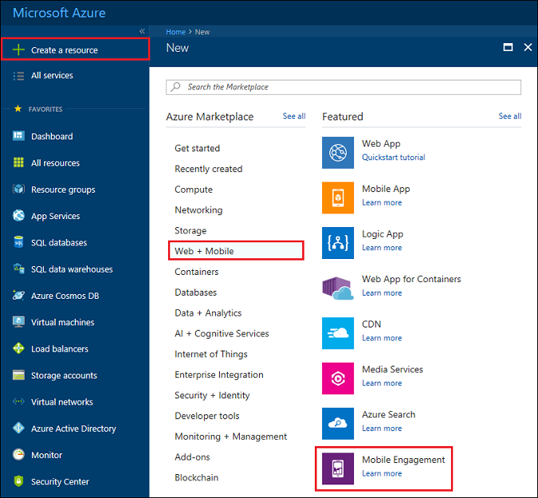
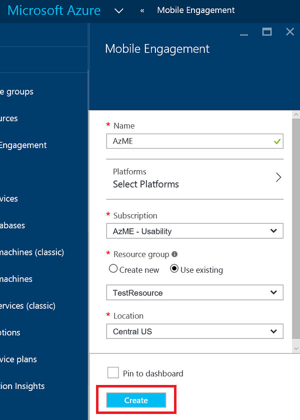
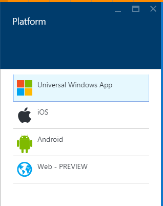
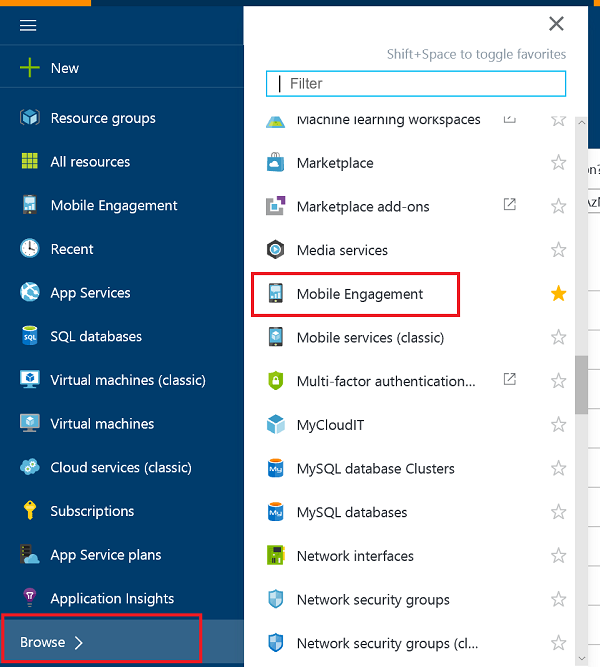
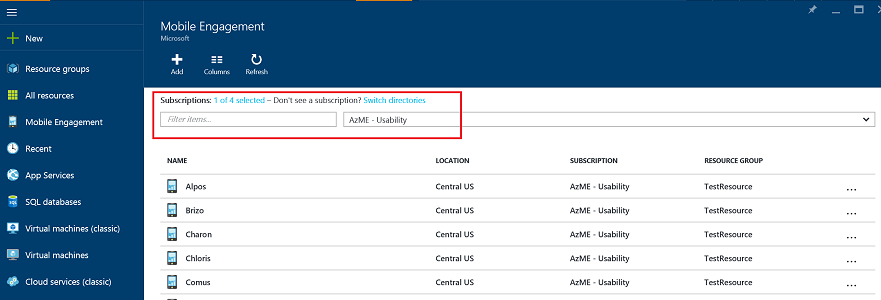
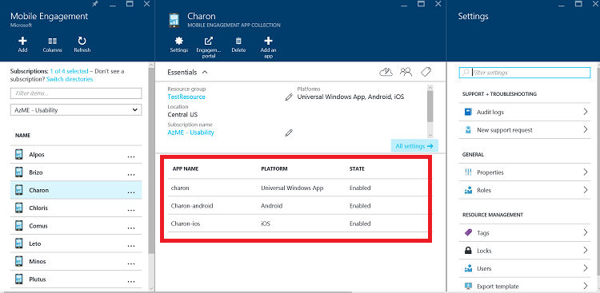
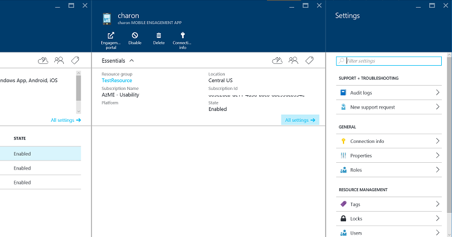
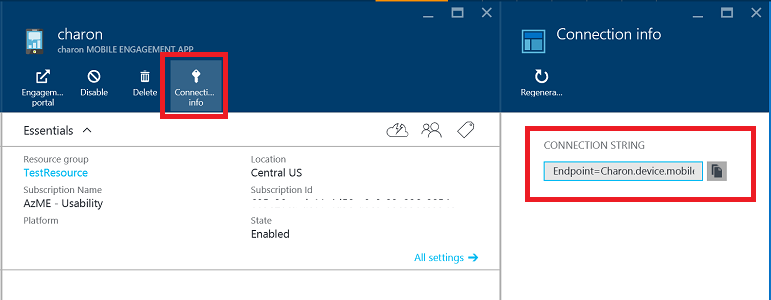

1. Log on to the [Azure Portal](https://portal.azure.com).

2. Click on **New**, then **Web + Mobile**, and then **Mobile Engagement**.

   	

3. In the **New Mobile Engagement App Collection** blade that appears, you will be creating an App Collection instead of an App like in the Azure classic portal. Enter the following information:

   	

	- **Name**: Name of your *application collection* 
	- **Platforms**: Select target platforms for your app on the Platforms blade which will open up. E.g. if you want an app for both iOS & Android then select both platforms and you will get two apps created under this app collection. 

   	

	- **Subscription**: Select the Azure subscription. 
	- **Resource group**: Select the Azure Resource group in which you want this Azure resource (Mobile Engagement App Collection). You can choose to create a new one.  
	- **Location**: Region where the data about this app collection & app will be stored.

5. Browse through the Mobile Engagement app collections by clicking **Browse** and search for **Mobile Engagement**

	

6. You will be shown a list of Mobile Engagement App Collections - make sure you have the same Azure subscription where you created your App Collection.

	

7. Click on the App Collection that you created in the prior step to open up the App Collection resource blade which will show the different apps present inside this app collection. 

	

8. Click on the App created for the platform you are developing for. 

	

9. Click on **Connection Info** command button at the top to open up the Connection Info blade and copy the connection string from there. 

	
