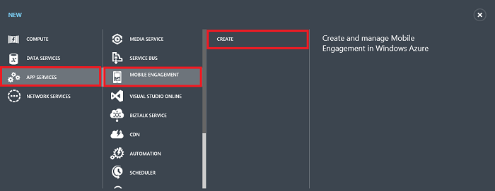
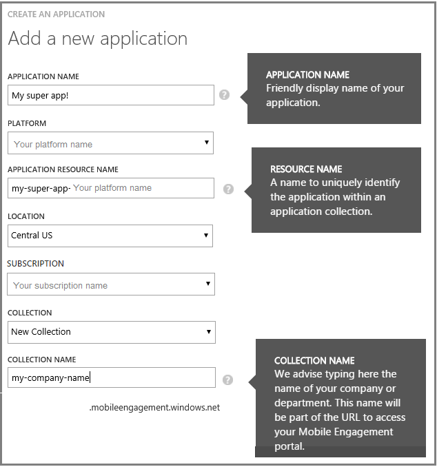
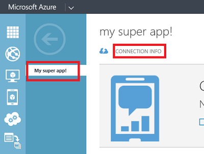
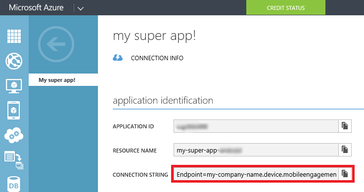

1. Log on to the Azure Management Portal, and then click **+NEW** at the bottom of the screen.

2. Click on **App Services**, then **Mobile Engagement**, and then **Create**.

   	

3. In the popup that appears, enter the following information:

   	

	- **Application Name**: Name of your application. 
	- **Platform**: Target platform for the app. You must create one Mobile Engagement app per platform that you are targeting for your mobile application. 
	- **Application Resource Name**: Name by which this application will be accessible via APIs and URLs. 
	- **Location**: Region/Data center where this app and app collection will be hosted.
	- **Collection**: Select a previously created Collection or select 'New Collection'.
	- **Collection Name**: Represents your group of applications. This will also ensure all your apps are in a group that will allow aggregated calculations of metrics. You should use your company name or department here if applicable.

4. Select the app you just created in the **Applications** tab.

5. Click on **Connection Info** in order to display the connection settings to put into your SDK integration in your mobile app.

   	

6. Copy the **Connection String** - this is what you will need to identify this app in your Application code and connect with Mobile Engagement from your App.

   	

