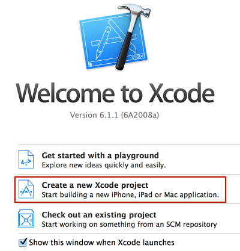
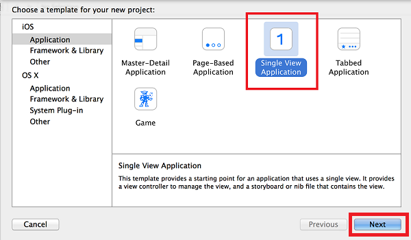
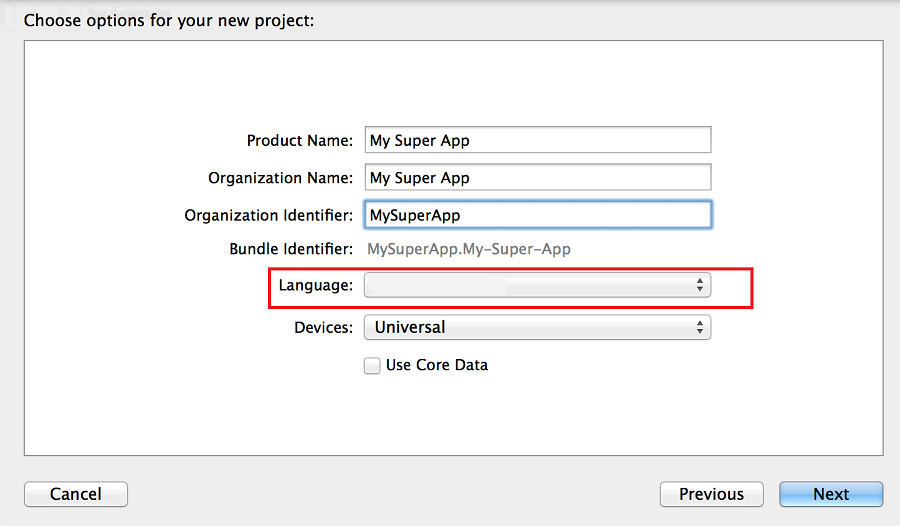

1. Start **Xcode** and in the pop-up, select **Create a new Xcode project**.

	

2. Select **Single View Application**, and then click **Next**.

	

3. Fill in the **Product Name**, **Organization Name**, and **Organization Identifier**. Select **Objective-C** or **Swift** in the **Language** selection based on your app.

	

> [AZURE.IMPORTANT] Make sure that the Bundle Identifier matches with what you have defined in the Apple Developer console for AppId and that you have a corresponding certificate for it. 

Xcode will create the demo app into which we integrate Mobile Engagement.

