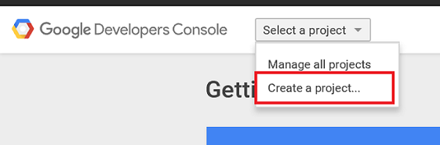
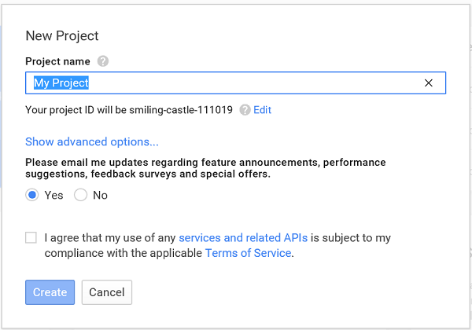

>[AZURE.NOTE] To complete this procedure, you must have a Google account that has a verified email address. To create a new Google account, go to <a href="http://go.microsoft.com/fwlink/p/?LinkId=268302" target="_blank">accounts.google.com</a>.

1. Navigate to the [Google Cloud Console](https://console.developers.google.com/project) and sign-in with your Google account credentials, and then click **Create Project**.

   	   

   	   

2. Enter a project name, accept the terms of service, and click **Create**. If requested, carry out the SMS Verification, and click **Create** again.

3. Make a note of the project number in the **Projects** section. You will need it later in the tutorial to populate in the Android Manifest file. 

   	   

4. In the left column, expand **APIs & auth**, click **APIs** then scroll down and click **Cloud Messaging for Android**. Then on the next page click **Enable API** and accept the terms of service. 

	

	

5. Click **Credentials**, and then click **Add Credential**->**API Key** 

   	

6. In **Create a new key**, click **Server key**. In the next window click **Create**.

   	

   	 

7. Make a note of the **API KEY** value. You will use this API key value later to configure in the "Native Push" section.

