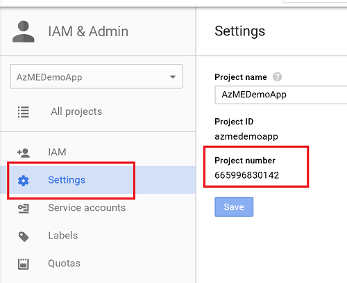
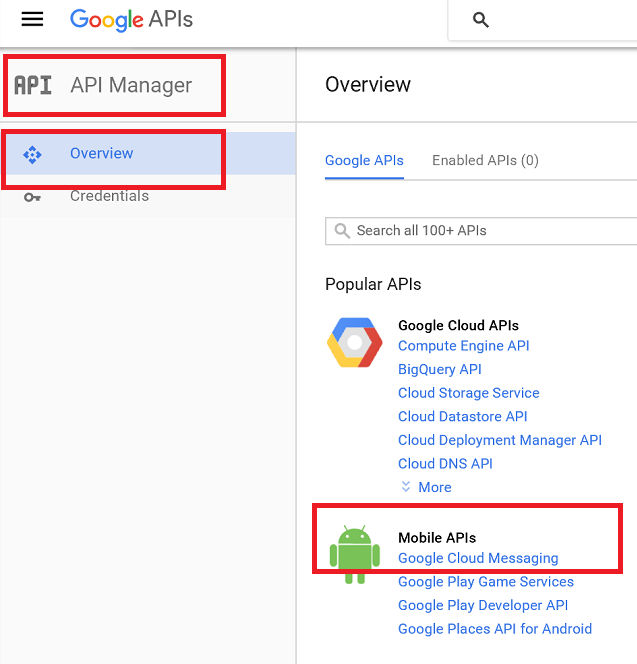
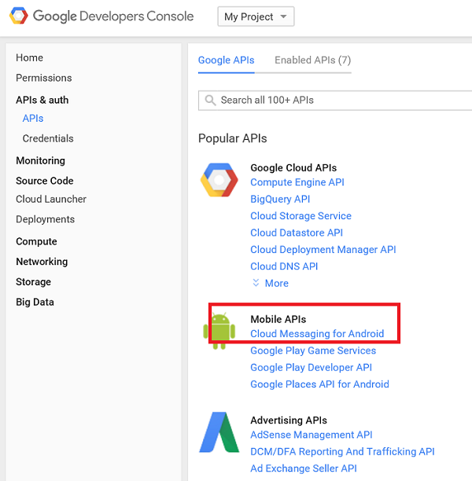
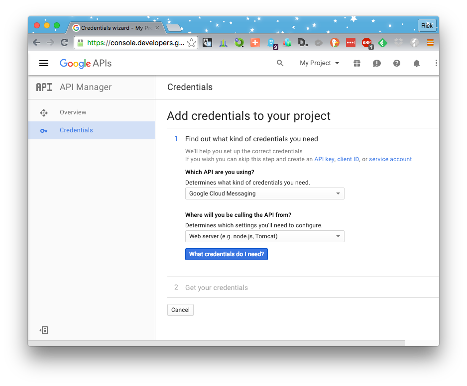
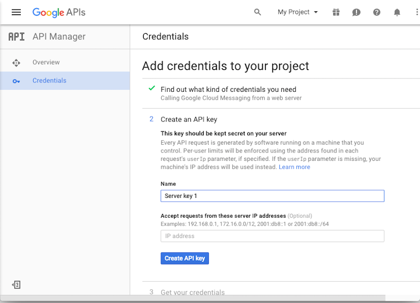

###Create a Google Cloud Messaging project with API key

>[AZURE.NOTE] To complete this procedure, you must have a Google account that has a verified email address. To create a new Google account, go to <a href="http://go.microsoft.com/fwlink/p/?LinkId=268302" target="_blank">accounts.google.com</a>.

1. Navigate to the [Google Cloud Console](https://console.developers.google.com/project) and sign-in with your Google account credentials.

2. Go to **All Projects** and then click **Create Project**.

3. Enter a **Project name** and click **Create**

4. Once the project is created then make sure that you are noting down the **Project number** which will be a long numerical value. You can find this under **IAM & Admin section** in the **Settings** of your Project and you will require this later. 
 
	

5. Now we will create a key for the Google Cloud messaging platform which will be used by our platform to send notifications to the Android devices. Go to the **API Manager** section and click on **Google Cloud Messaging** under **Mobile APIs**. 

	

6. On the next page, click **Enable** button. The dashboard will prompt you to create credentials. So click on **Go to Credentials** button. 

	

6. Select **Google Cloud Messaging** from the first dropdown box and **Web server** from the second one, and then click **What credentials do I need?**

   	

7. In **Add credentials to your project** page, click **Create API key**.

   	

8. Make a note of the **API KEY** value. You will use this API key value later to configure in the "Native Push" section. Now click **Done**.
